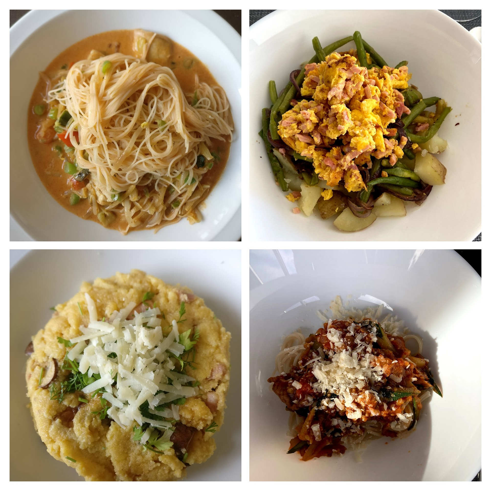
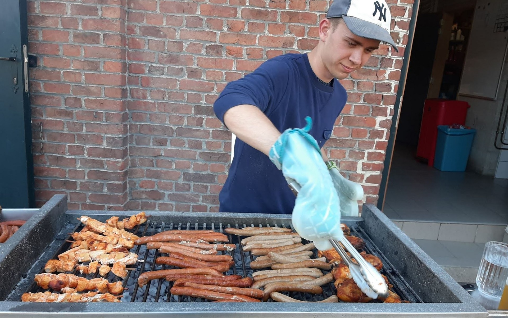

For the past six years I have been doing volunteering as a cook at Clip Taalvakanties, which organizes summer camps to teach Flemish youth either French or English using an active approach: The participants have to use the foreign language as much as possible for the whole duration of the camp, in essence taking a "language bath". Unsurprisingly, for a lot of people this approach yields vastly superior results compared to studying from a textbook.

Starting out as a participant myself, barely knowing my way around a kitchen, I certainly learnt a heck of a lot working in one, eventually being able to take up management for a kitchen crew myself and assist in the formation of new cooks. In this article I want to explore what I've learnt by spending this time volunteering, since I believe there's actually quite a bit to unpack.

## Technical knowhow

By spending time working in a field initially unknown to me, speaking French rather than my mother tongue I obviously gained a lot of technical knowhow.

First off is language. While my grammar and vocabulary might not be up to par with people that were raised bilingually, most of the time I'm able to express myself in French quite fluently. Even though in Belgium French is taught from a very young age in schools, as early as primary education, I don't think I could have developed this level of comfort with the language without the practice offered by these camps.

Additionally, I learnt how to cook. Before these camps I enjoyed baking a cake or making cookies every now and again, but I never strayed far outside of that. Nowadays I'm able to whip together a tasty and healthy meal for myself (and some friends) in 30-45 minutes at a third the cost of takeaway. To be fair, this took a bit of learning and experimenting on my own time, but the vast majority of knowledge and techniques are things I acquired during those weeks at Clip.

Go check out my [photo album](https://photos.app.goo.gl/RFa5tXw5w2AeBb3x8) of dishes I made over the years and keep as a source of inspiration.

While both of the skills discussed above have already proved immensely useful, they're only the tip of the iceberg. In the next two sections I discuss two more categories of lessons resulting from my summer camps which might be a bit more subtle but carry even larger consequences.

## Productivity enhancers

As a cook I started out simply following others, letting others do the thinking for me. In the beginning this worked fine, since I still had so much to learn about the technical aspects. As these improved, I gradually started taking up more responsibilities: taking diets and food allergies into account, making sure the kitchen meets health codes, thinking about portion sizes, keeping an eye on timing.

Doing so, I picked up a thing or two about work ethic, productivity and even management. In this section the three lessons that stuck most with me are listed, along with examples of how I apply these in real life.

### 1. Work hard, rest well

In the kitchen, it's very easy to identify when your work is done. If the meals are prepped, the dishes are done and the kitchen is clean, you can close the doors. By focusing on the task at hand and working hard while doing so, it's possible to create more time for leisure activities seemingly out of thin air. Extending the leisure time results in feeling more refreshed when picking the work back up, in turn making it easier to work hard again. Truly a self-amplifying mechanism.

I built an intuition for this by working as a cook, but the full realization of the effectiveness only came to me after reading [Deep Work](https://www.calnewport.com/books/deep-work/) by Cal Newport. Whenever possible, I try to use this technique in my daily life as well. I strive to work for shorter periods with intense focus, taking breaks when I feel my attention starts to dwindle. I believe this is the most effective way of achieving the results I desire without wrecking myself trying to do so.

### 2. Lead by example

While productivity tips such as the one above are excellent tools for individual work, working in group effectively requires more than just that. During the weeks I got to manage a kitchen crew myself I got to see the effectiveness of leading by example in practice.

Leading by example means "putting your money where your mouth is" in the context of your work. By bringing a lot of energy and having a good work ethic myself, my fellow cooks seemed to take little issue with my proposal to **work hard and rest well**. In comparison, at moments I was less present myself I noticed how the energy levels of the group seemed to drop accordingly.

Of course some of this might just be correlation rather than causation and there are certainly limits to the effectiveness of this technique. Therefore I would advise to combine it with other motivators. For example, I tried to make the leisure time created by working hard somewhat special as often as I could to ensure they're something to look forward to.

### 3. Own it

Whatever you do, own it. And encourage others to do the same. Ownership is in my opinion the most powerful when it comes to achieving things and makes working in group much easier.

Taking ownership entails much more than simply **taking responsibility**. Besides applying the principle of **dividing and conquering**, you give people control over the project: developing a strategy of how to achieve the goal and trying to overcome hurdles along the way. You make them **think for themselves**. As a result, the feelings of involvement and independence rise significantly and success for the project becomes a personal victory, however small the achievement.

The best example I can think of is the week's last cooking workshop, an activity where the participants come and help prepare that day's meals, at one of the camps I did last year. I gave two of my cooks full control over the organization and only told them I would like the appetizers for the evening to be done by the end of it. And boy did they deliver. In the timespan of one hour they managed not only to finish the appetizers, but to prepare a crumble and a rainbow cake among other things for the dessert buffet as well.

## Interpersonal skills

At summer camp one meets people who have trodden many different walks of life, in essence expanding the "little village" of people you know beyond those who live in your neighborhood or the ones you study/work with. This allowed me to grow from a shy and socially awkward kid to the more self-confident and openminded person I am today.

Spending time with my fellow cooks and co-camp counselors and interacting with participants played a big role in this evolution. Besides just being more sociable and extraverted than I used to be, I also find my capacity for empathy has grown, I'm more trusting and better able to hold conversations, even difficult ones if necessary.

It is often said between Clippers (as we call ourselves) that by joining the organization, you also join a second family. I tend to agree. After these six years, among my closest friends are some of the people I met during these summers. They are people I can have incredible fun with and I trust would have my back should times of need arise. Since I would've had little chance of meeting them if not trough Clip, they are the reason I'm most grateful for signing up to volunteer six years ago.
