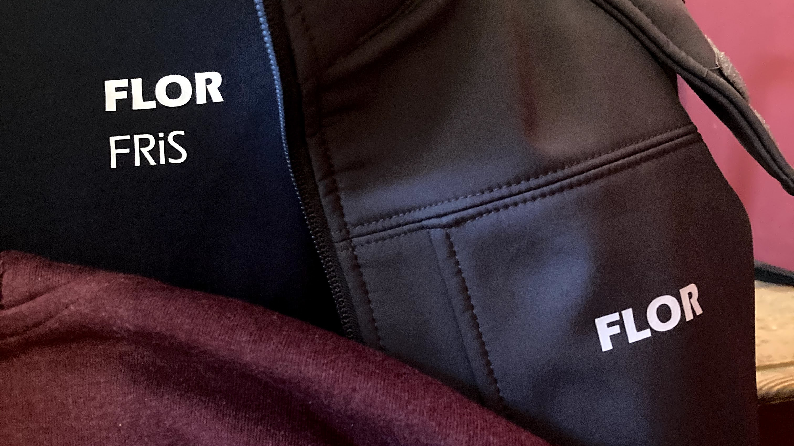
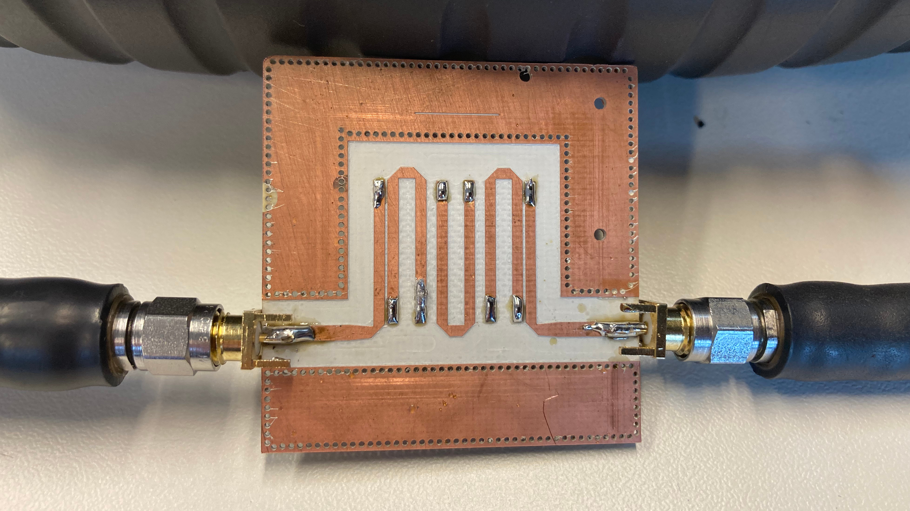
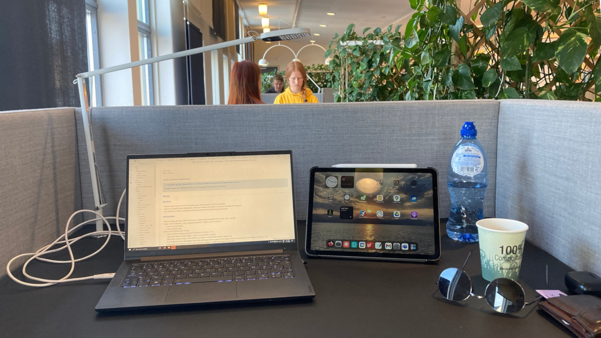
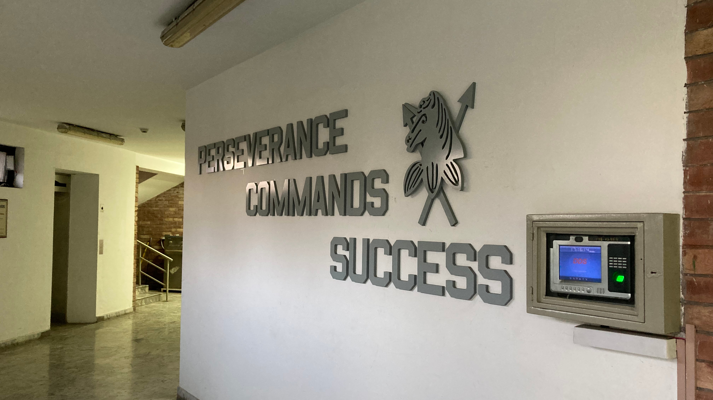

Flashback to the summer of 2020, a much-needed respite from the relentless grip of the Covid pandemic and the accompanying safety measures. [Fresh out of my electrical engineering bachelor](https://www.florsanders.be/posts/lookback/), little did I know what lay ahead as I eagerly embraced the freedom of a carefree summer, brimming with ambitious plans for my upcoming master studies.

In this article, I invite you to join me on a journey through the years that unfolded between that hopeful summer and the present moment, which marks the culmination of my master studies. Looking back, I realize how little I could have anticipated the remarkable twists and turns that shaped my path during this transformative period.

## My big plans

During my bachelor studies, an unexpected invitation from a friend led
me to attend a general assembly meeting of FRiS, the engineering faculty student council. As I immersed myself in the discussions, a realization began to dawn upon me - the crucial role student representatives played in shaping the vision and actions of Ghent University. What started as a casual meeting soon transformed into a deeper commitment.
Wanting to help amplify the voices of my fellow students, I decided to join the boards of [FRiS](https://fris.ugent.be/) and [VTK Gent](https://vtk.ugent.be/), assuming the responsibilities of a student representative advocate and serving as a liaison between these organizations and the faculty councils.

Simultaneously, driven by my desire to bridge the gap between theory and practice, I made a deliberate choice to enroll in courses with significant project components during my first semester. From programming a robot minesweeper to designing antennas and utilizing machine learning algorithms for traffic sign recognition, I finally felt like I was starting to bring my engineering dreams to life.

However, as October drew to a close, the relentless second wave of the Covid pandemic loomed, and it became evident that lockdown measures would soon be reinstated. With remote learning becoming the norm once again and many students feeling adrift amidst the chaos, our work at FRiS became increasingly challenging. Moreover, the projects I had enthusiastically embraced now had to be completed solely through virtual interactions, with some team members seemingly disappearing as soon as the lockdowns began. It was during this period that the tides began to turn, and the weight of the demanding workload coupled with the social isolation gradually eroded my motivation. By the end of my first semester, it became abundantly clear that a change was necessary.

## Switching gears

Embracing change can be challenging, yet essential for personal growth. In my case, it meant taking a step back, listening to my instincts, and finding inspiration in my surroundings. I realized that a major source of my frustration stemmed from the belief that much of my academic work would end up forgotten and unused. I yearned for a way to make a tangible impact with my skills.

Fortuitously, a fellow member of the VTK praesidium introduced me to the world of student entrepreneurship. He shared his experiences of assisting companies through small-scale software engineering projects. Intrigued and eager to make a difference, I decided to venture into the realm of freelancing.

However, transitioning into the role of a freelancer is not as simple as proclaiming oneself as one. Given my limited professional experience, I had to start small. I reached out to [redpencil.io](https://redpencil.io), a company I had encountered during [my internship](https://www.florsanders.be/posts/solidiot/) at [District09](https://district09.gent/). I explained my aspirations and expressed my interest in working as a freelancer for them. To my delight, they agreed to give me a chance.

And so, my new adventure began. Of course, the actual work demanded a significant investment of time and effort. Adding it to my existing workload would have undoubtedly led to burnout. Instead, I made the decision to extend my graduation timeline by one year, granting me the flexibility to manage my academic commitments more effectively.

## Lessons

Throughout this journey, I have had the privilege of working on [several more projects](https://www.florsanders.be/projects) for organizations such as [Crunch Analytics](https://www.crunchanalytics.be/), [Alert! Opleidingen](https://alert-opleidingen.be/), [Heliovision](https://www.heliovision.be/) and [Botko](https://www.botko.be/). These experiences have provided me with invaluable lessons that have shaped my perspective.

### Nurture your passions

Above all, the most profound realization I have gained from this entire experience is the importance of following one's passions. By embracing change and pursuing my interests, I swiftly regained my motivation. Despite dedicating more hours to work overall, I found myself energized because I was creating tangible value for others through my contributions.

By balancing university assignments, freelance work, and my thesis in my final year, I pushed the boundaries of my knowledge and skills beyond what I had previously thought possible. Stepping outside my comfort zone and delving into my passions allowed me to accelerate my learning in ways that would have been unattainable otherwise.

### Disregard the non-believers

Firstly, I must emphasize how fortunate I have been to receive unwavering support from those around me throughout this process. I have been granted incredible opportunities, and I am eternally grateful for them.

However, it would be remiss not to acknowledge the skeptics. Along the way I have encountered some skeptics, such as this one company whose HR team doubted the value I could bring as a part-time freelancer and a student still pursuing my master's degree. They suggested I reach out to them once I had graduated. Well, I won't be contacting them when I graduate. Instead, I will collaborate with those who possess the flexibility of mind to think outside the box and create opportunities through creative thinking.

### Go the extra mile

Want to exceed expectations and leave a lasting impression? **Go the extra mile**.

Yes, it may sound like a cliché, but it holds profound truth. Rather than approaching tasks at face value, I always strive to understand how they fit into the bigger picture. This allows me to evaluate the most effective approach to solving the presented problem. While there may be instances where shortcuts are necessary, it does not mean compromising on quality. By investing that extra effort to revisit and refine the work, the impact can be significant.

Don't believe the difference it can make? Just take a moment to read the testimonials from those I have had the pleasure of working with.

> Glad you were here, Flor. Hope our paths cross again. Be it virtual or physical, you've made yourself very welcome.  
> ~ Aad Versteden @ redpencil.io

> During these projects [Flor] has demonstrated a level of professionalism and independence that I usually only observe from people with significantly more experience.  
> ~ Louis-Philippe Kerkhove @ Crunch Analytics

> While this chapter is closed for now, know that we want you back when you return to Belgium.  
> ~ Emile Derache @ Heliovision & Botko

By embracing my passions, dismissing the non-believers, and consistently going above and beyond, I have grown both personally and professionally. This journey has not only expanded my technical expertise but also solidified my belief in the power of embracing change and pursuing what truly inspires me.

## What's next?

My time at Ghent University and my thrilling experiences as a student-entrepreneur have reached an incredibly fulfilling culmination. Like all good things, however, this chapter must now come to a close.

Looking back, this reflective post serves as a reminder of the unpredictability of the future. Instead of making bold predictions about where I will find myself in three or five years, I would rather share my plans for the upcoming year. Thanks to the support of the [BAEF fellowship program](https://baef.be/), I have the incredible opportunity to embark on a new adventure in New York City, where I will be continuing my electrical engineering studies at Columbia University.

As for what lies beyond that, only time will tell.  
Stay tuned for updates from the vibrant streets of the Big Apple!
