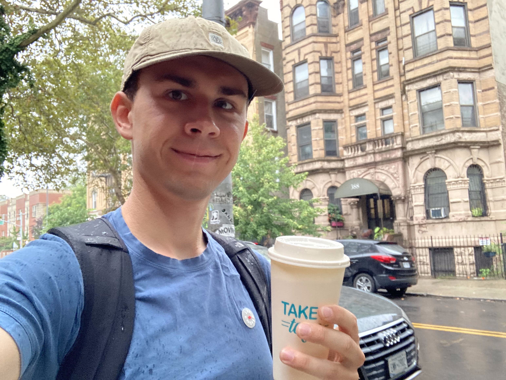
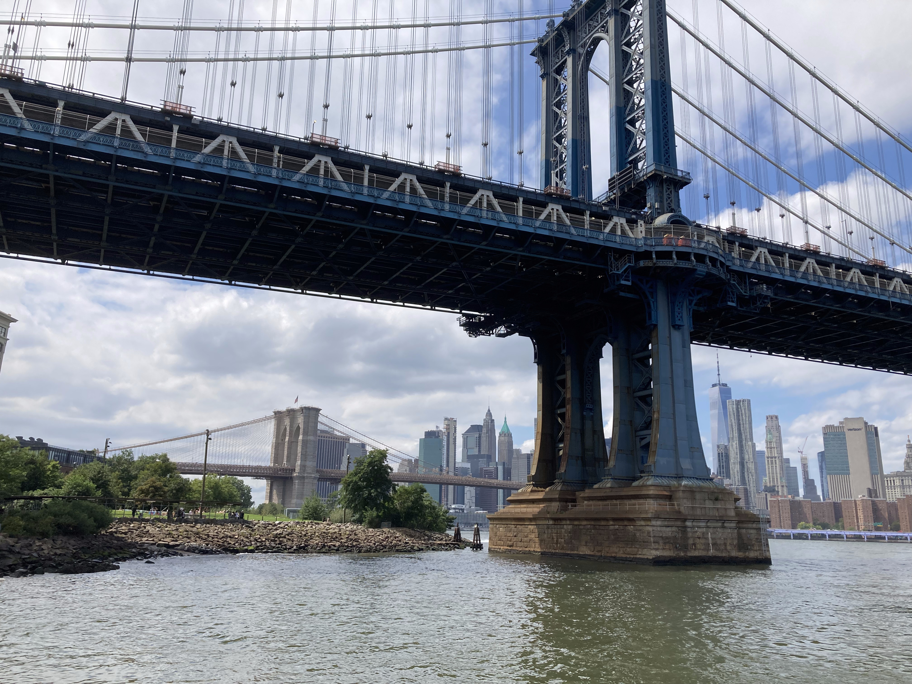
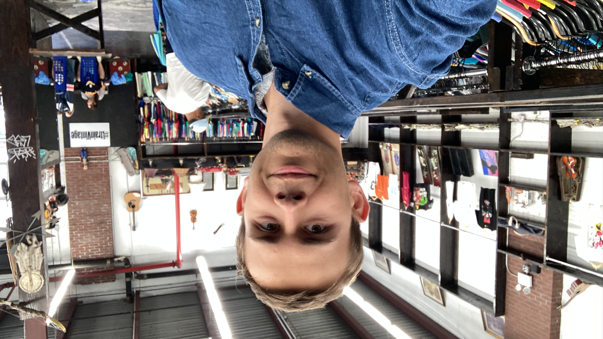
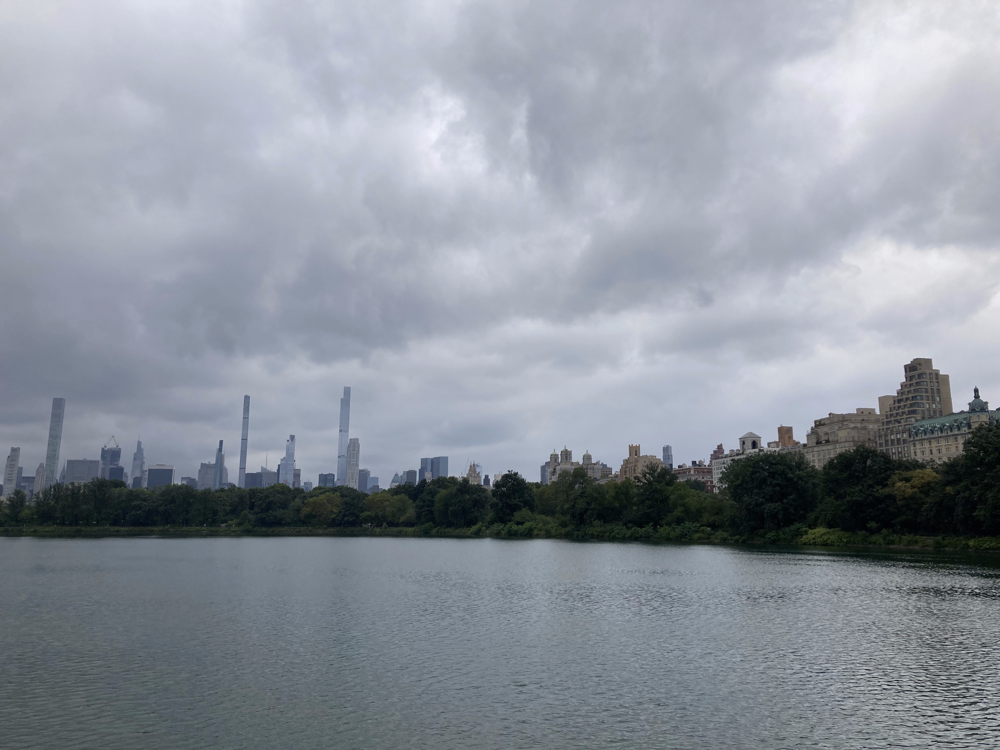
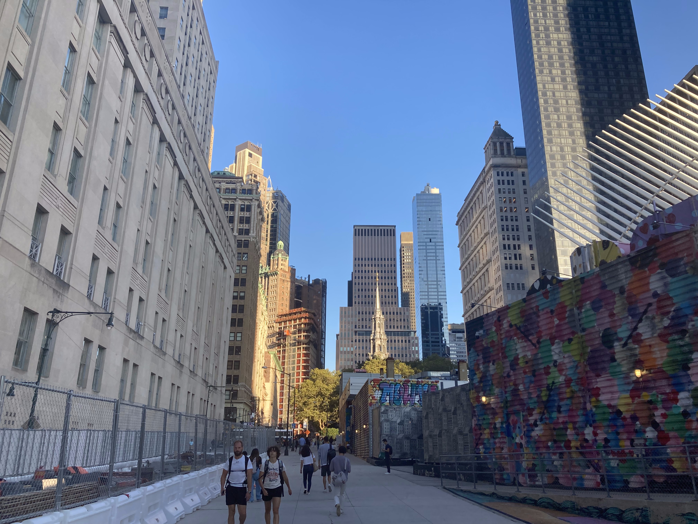
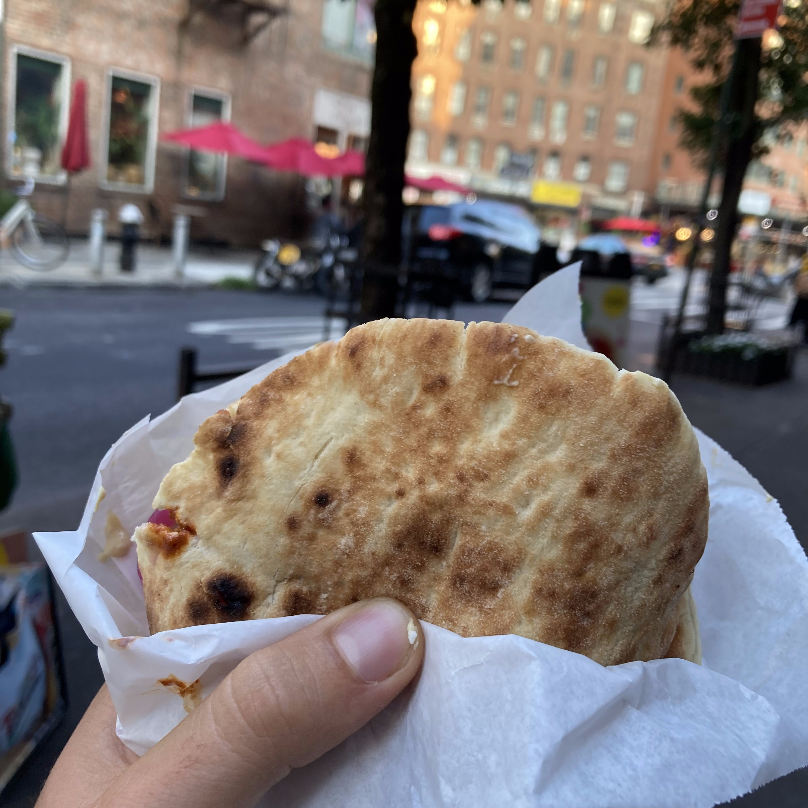
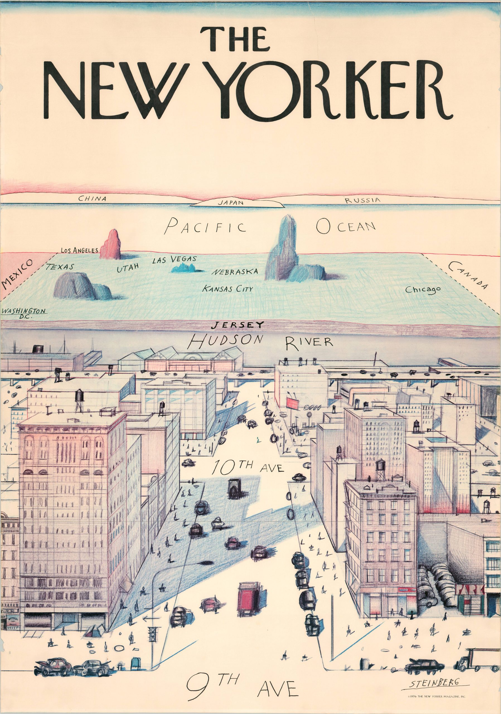
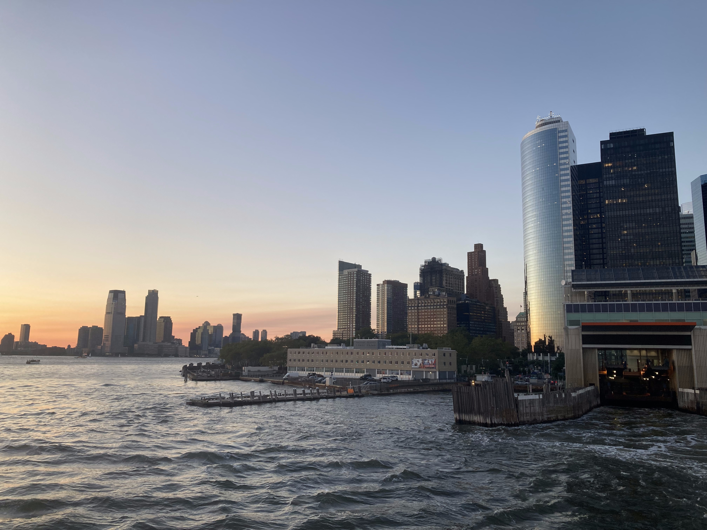
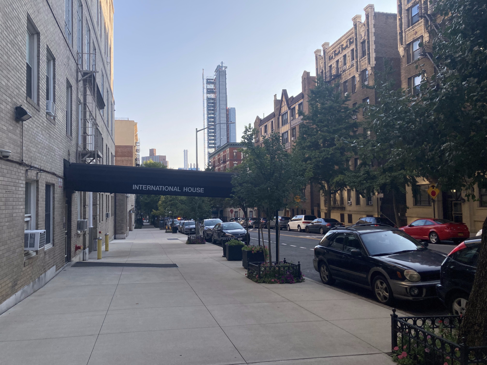

August 24th marked the day I bid adieu to my friends and family in Belgium, embarking on a thrilling adventure across the Atlantic. My destination? The bustling, iconic streets of New York City, where I would commence my graduate studies in Electrical Engineering at the prestigious Columbia University.

But what's it really like, one week into this novel experience?

### A Tourist in the Concrete Jungle

With my classes only starting on September 5th, I found myself with an abundance of time to acquint myself with the Big Apple. Having never set foot on American soil before, I seized this golden opportunity to embrace my inner tourist. Over the past week, I've ventured into some of the quintessential New York experiences, and a few have left a mark on my memory.

#### 1. A stroll Across the Brooklyn Bridge

The Brooklyn Bridge, while undeniably breathtaking with its panoramic views, turned out to be a tad overrated. The structure is teeming with visitors and adorned with touristy stalls peddling trinkets and souvenirs. However, crossing this iconic bridge leads you to Dumbo, the picturesque Brooklyn Heights, and the sprawling beauty of Brooklyn Bridge Park. This charming neighborhood is perfect for leisurely strolls, coffee sipping, and marveling at the grandeur of Manhattan just across the water.

I'll give the Brooklyn Bridge another try once summer is over and the streets are hopefully somewhat calmer.

#### 2. Treasure Hunting in Brooklyn

For Europeans like me, New York offers some interesting shopping opportunities, since all the renowned American brands are available at more wallet-friendly prices. But here's a tip: skip the bustling city center and head to Brooklyn for a thrift shopping adventure. In the heart of this borough, you'll find stores like Urban Jungle and Le Point Value, where quality clothing can be had for a mere $5 to $10 per piece. It's a budget-conscious shopper's paradise.

#### 3. Central Park: An Urban Oasis

A leisurely stroll through Central Park is an experience that transcends words. It provides a welcome and comprehensive escape from the relentless bustle of the city streets. After wrapping up my campus responsibilities on my first day in town, I dedicated an entire afternoon to meandering from the park's northern reaches to its southern expanse. Watching the Lower Manhattan skyline arise from amidst the trees is just something else.

### A New Yorker in the Making

As I continued my urban expeditions, I couldn't help realize that my perspective was already evolving. I wasn't just a wide-eyed tourist ticking off must-see sights. I was also becoming a temporary resident, preparing to call this vibrant city home for a year. Consequently, I adopted a more leisurely approach, allowing myself to wander through the boroughs and soak in the city's essence. To my pleasant surprise, many of the warnings and preconceived notions I'd heard turned out to be either exaggerated or simply untrue.

1. Yes, Downtown Manhattan can be a whirlwind of activity, but the rest of the city often reveals a different story. In fact, I found many neighborhoods to be surprisingly tranquil and inviting.

2. Similarly, while the subway system does live up to its reputation of being crowded during rush hours, other times offer a completely different experience. With its extensive coverage and remarkable reliability (trains arrive every few minutes), it has quickly become my preferred mode of transportation.

3. Contrary to the stereotypical American diet of burgers and fries, I managed to steer clear of such fare entirely during my first week in NYC. Instead, I indulged in a delightful array of authentic international cuisines, from Mexican to Mediterrat nean and Italian. The city offers a culinary voyage like no other, if you only look in the right places.

4. New York City is eminently walkable, thanks to its broad sidewalks and pedestrian-friendly traffic signals. Jaywalking, it seems, is an unspoken city norm when cars are scarce. Despite the city's vastness, I embraced the art of strolling and found myself consistently walking 20 kilometers or more during my initial days here.

5. Green spaces are more abundant than I anticipated. Beyond Central Park, tree-lined streets grace many neighborhoods. Prospect Park in Brooklyn, where locals gather for picnics and barbecues on weekends, and Morningside Park, nestled right next to my campus at Columbia University, are testament to the city's dedication to greenery.

While my misconceptions about New York City crumbled one by one, it's important to acknowledge the city's challenges. Homelessness and drug use are pervasive and pressing issues, and litter mars some neighborhoods. Yet, amidst these challenges, I've learned to look up to the towering skyline for inspiration rather than down at the littered sidewalks. In this dynamic metropolis, every aspect carries its own unique story and charm, waiting to be discovered anew with each passing day.

### New York's Unique Aura

New York City possesses an unmistakable allure that sets it apart, even as [larger cities](https://en.wikipedia.org/wiki/List_of_largest_cities) have eclipsed its population since 1950. While some argue that it has [diminished over time](https://english.alarabiya.net/views/2022/10/24/New-York-is-the-cultural-capital-of-nowhere), the city continues to exude a unique significance.

Independent journalist Johnny Harris [sheds light on this phenomenon](https://www.youtube.com/watch?v=McLgpck2i7A), attributing it to New York's strategic East Coast location, offering easy access to the ocean and Great Lakes via interconnected rivers. Settlers harnessed these waterways for efficient transportation, and during the Industrial Revolution, New York became the world's factory. This magnetism drew an influx of foreign labor, weaving a rich tapestry of cultures and defining the city's distinct character. This cultural diversity, in turn, transformed New York into a global hub for modern art and a bastion of cultural capital.

Yet, there's another facet to the enchantment of this city. One evening, aboard the Staten Island Ferry at sunset, I witnessed the cityscape bathed in the day's final sunlight. It was a breathtaking sight. As we passed the Statue of Liberty, encircled by ships and helicopters, and glimpsed the industrial grandeur of the harbor before docking at Staten Island, a profound realization struck me: humanity's mastery over the earth was vividly displayed in this urban landscape.  
Here in New York, life revolves less around nature and survival, and more around chasing dreams, from impressive careers to captivating Instagram posts, or, in my case, a transformative education.

### Embracing the City and the Journey Ahead

As I prepare to dive into my studies at Columbia University in the coming weeks, my excitement is twofold. Beyond academic pursuits, I'm eager to immerse myself in the multifaceted history and culture that New York City has to offer. Residing in The International House, I anticipate engaging with the vibrant tapestry of this diverse community, which, in many ways, mirrors the city itself.

I want to express my sincere gratitude to the [Belgian American Education Foundation](https://baef.be/) for their invaluable support, both financially and logistically, in making this adventure possible. The journey is just beginning, and I eagerly anticipate the experiences, growth, and discoveries that lie ahead in the heart of the Big Apple.
