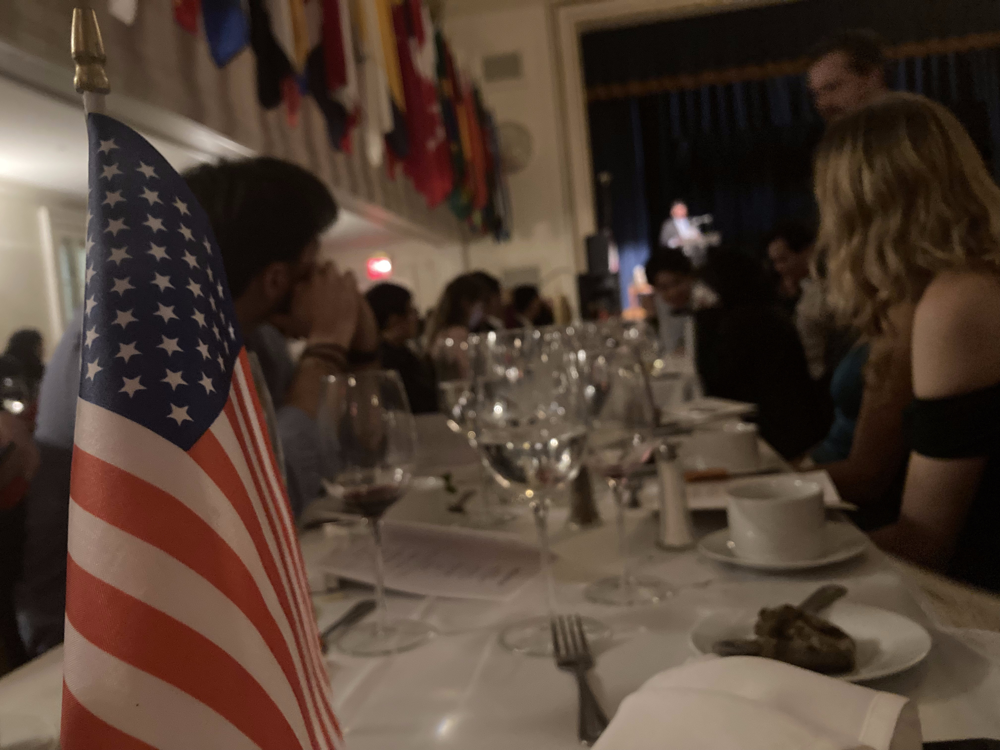
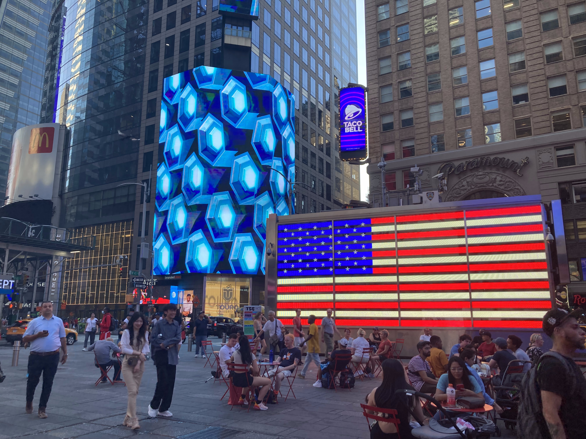
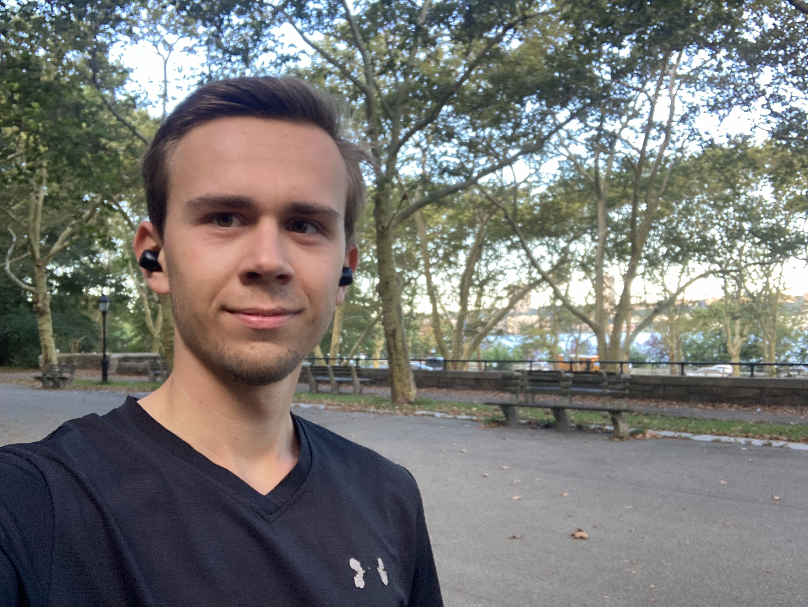
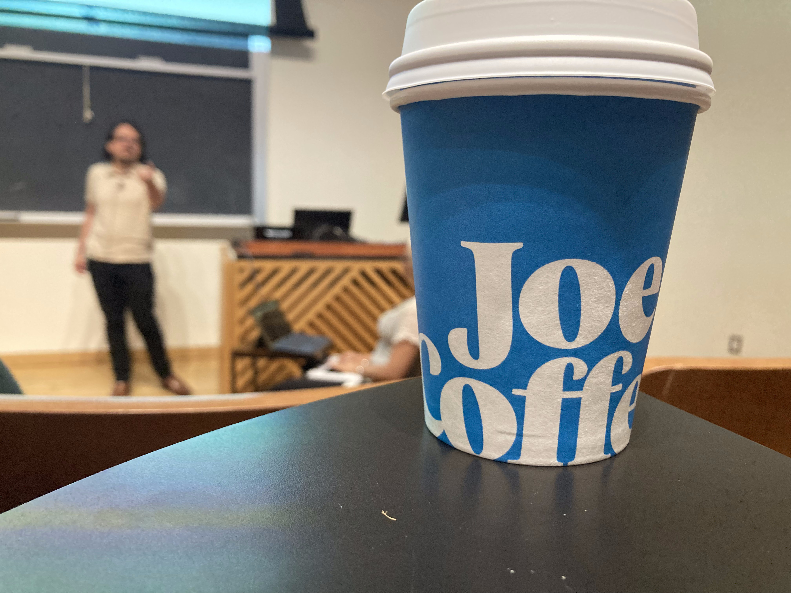
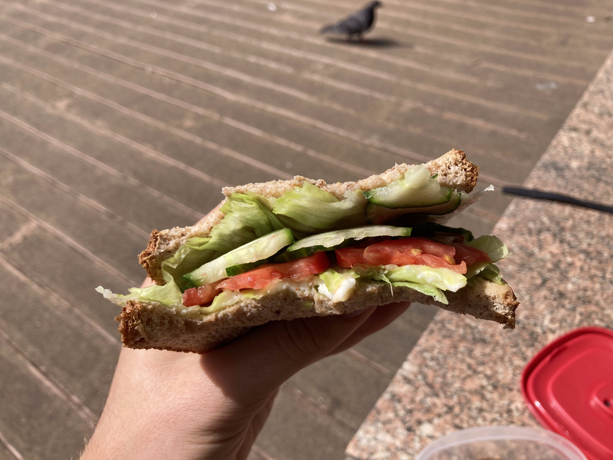
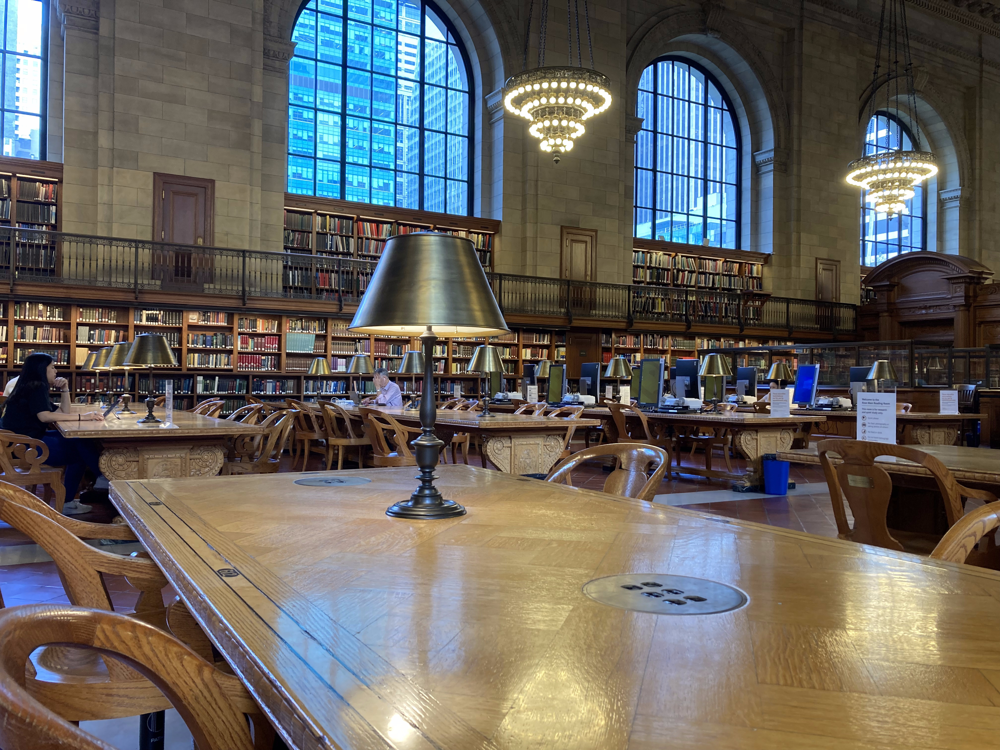

It has been precisely one month since I embarked on my journey to New York City, ready to dive headfirst into my graduate studies at Columbia University. The [initial seven days](https://www.florsanders.be/posts/nyc1/) I wore the hat of a tourist, familiarizing myself with the city's vibrant streets. As the courses commenced, I gradually settled into the cadence of this bustling metropolis.

In many ways, moving here has felt like hitting the reset button on various aspects of my life, crafting a new beginning from the ground up. In this post, I delve into the myriad experiences I've encountered
during this pivotal first month, sharing the profound sense of renewal that has characterized my journey thus far.

### Cultivating Connections in a New World

One of the most profound challenges in crossing the ocean for a year is the disconnection from my established social circle. My family, friends and girlfriend, anchors of my life, are dearly missed as I carve a new path in this sprawling city. The anticipation of their visits in the coming yea keeps my spirit high, eager to share the wonders of New York City. Fortunately, the marvels of modern communication technology, which happens to be my field of study, bridge the thousands of miles between us.

Yet, arriving here meant hitting reset on my social network. With just a handful of familiar faces in NYC, building a new social tapestry in Manhattan was an exciting yet nerve-wracking prospect. My concerns, however, swiftly dissipated upon touching down in the city that never sleeps. I attribute this to three key factors, alongside my own determined efforts.

#### 1. The International House: A Home Away from Home

[The International House](https://www.ihouse-nyc.org/), or iHouse for short, serves as my home base for the upcoming year. Over the past 99 years, it has welcomed students from across the globe, fostering mutual understanding and a global perspective. In just a short few weeks, I have formed meaningful connections through their events, in the dining hall and even while roaming its corridors. The sense of community within these walls is truly remarkable, one I know I will cherish for a lifetime. It is a world of difference compared to my initial week in New York, spent in a Brooklyn Airbnb.

#### 2. English as the Universal Language

Beyond my residence, language has proven to be an important bridge to forge new connections. It goes without saying that the vast majority of individuals relocating to New York posses proficiency in English. This shared foundation provides a distinct advantage in connecting with others. The prevalence of English as the de facto language among natives further eliminates the need for language switching to accommodate for conversation with internationals. It erases the barriers and the feeling of being an outsider that can sometimes accompany cross-cultural exchanges. In this way it transcends the European experience.

#### 3. The Vastness of the United States

Lastly, I have noticed that American students are just as open to meeting new people as international students. This contrasts with the experiences I've heard from international people in Ghent. In addition to a common language, I believe the sheer size of the United States plays a role here. As I've listened to their stories, it is clea that many of them are also far from home, whether it is California, Texas or even Hawaii, these students share a similar experience as us internationals.

Thanks to these factors, I have already cultivated connections with individuals from all corners of the world within these few short weeks. With diverse backgrounds, cultures and fields of study, I have been reminded of the vastness of the world and my ignorance of many topics. Already, my perspective has broadened, and my worldview has shifted. In the coming months, I'll continue my endeavor to connect with new faces, absorb fresh knowledge, and embrace novel experiences.

### Rediscovering My Routine

The change of pace and environment has presented me a unique opportunity for me to reassess my daily routine and habits, prompting me to deliberate on how I wish to allocate my time. In some sense, this evaluation was necessary as some fundamental habits that defined my student life in Belgium have become impractical in my new hometown.

One striking example is my approach to cooking, or rather lack thereof. In Ghent, I delighted in crafting fresh meals both for myself and for friends who dropped by. However, the absence of a kitchen in my new residence has rendered that ritual virtually impossible. Instead, I have found myself regularly dining at the iHouse dining hall, joined by my fellow residents. The newfound freedom from grocery runs and cooking has gifted me with a surplus of time each week. Over the past three weeks, I have redirected this time to getting in better shape, leveraging the 24/7 fitness hall at iHouse and going on the occasional run. This endeavor has become my way of staying active, compensating for the absence of my trusted bicycle, my primary mode of transport during my past six years in Ghent.

These shifts, among numerous other subtleties, have painted a stark contrast between my life in New York and my life in Belgium. As I navigate this unique experience, my aspiration is to blend the best elements of both lifestyles when I return to Belgium.

### Shuffling Between Yardsticks

Among the intriguing resets in my transition, recalibrating my grasp of units stands as a seemingly benign yet engaging challenge. While the American scientific community adopted the metric system a long time ago, daily life still pulses with the beat of freedom units. Akin to my days in kindergarten, I had to revisit the fundamentals and acquaint myself with this alternate measurement universe.

For those, like me just a few weeks ago, who are not well-versed in imperial units, let's test your knowledge with a few questions:

- Do you prefer an 8 oz or 12 oz coffee? And how does that translate to cups?

- How many pounds of beef should grace your chili con carne for a party of 4? And how many ounces of tomatoes should join the mix?

- When the thermometer reads 80°F outside, what wardrobe choices should you make?

- You're clocking a pace of 8 minutes per mile during your run. Impressive, right? Or is it?

- This almond milk is priced at $6 per gallon. What's the equivalent cost per liter?

It is questions like these that have been plaguing me for the past month. While I could easily sidestep most of these conundrums by clinging to the metric units I'm accustomed to (thankfully, many food products include both on their labels), I've taken it upon myself to embrace this alternative system and master the art of on-the-fly conversions. This skill has proven invaluable during interactions with fellow U.S. residents, most of whom lack an intuitive grasp of the metric system.

### Navigating the Financial Landscape

Inextricably linked to the realm of units is my ongoing adjustment to the price tags attached to everyday items in this vibrant city. New York City's reputation for high living costs precedes it, with the average monthly rent for a Manhattan studio soaring to a daunting [$3 500](https://www.renthop.com/average-rent-in/manhattan-new-york-ny). Fortunately, my accommodation at iHouse don't come anywhere close to that figure.

These steep real estate rates reverberate throughout every facet of daily life, though. Whether it concerns groceries or dining out, brace yourself to fork over one and a half to three times what you would typically pay in Belgium. It's a startling realization that turns the tables on my perception of my home country as an economical place to reside, taxes and all. Of course, the high cost of living here is often counterbalanced by more substantial wages, but as someone not enjoying that particular advantage and still grappling with these lofty price tags, it has been a readjustment in every sense.

Thankfully, my financial footing has been bolstered by the generous support of the [BAEF](https://baef.be/) scholarship, which has certainly eased the transition. Additionally, I have found some straightforward ways to keep my day-to-day expenses in check. Simple tricks like brewing my own tea instead of splurging on pricey coffee, crafting homemade sandwiches for lunch and indulging in the affordability of bananas and peanuts, which have proven surprisingly cost-effective in this cityscape.

### Mastering My Master's Studies

Diving into the realm of complementary master's studies has been an adventure like no other. In my final year at Ghent University, I was immersed in thesis research and nurturing my freelance business. This instilled in me a knack for practical problem-solving in the realm of applied engineering projects.

During my first week of classes here in New York, I attended more lectures than I had in my entire last academic year in Ghent. Fortunately, I have since settled into a chosen roster of courses for the semester, allowing my schedule to calm down. Returning to the basics and immersing myself in lectures has proven a bit of a readjustment, despite only recently completing my last degree program in June.

With a workload encompassing five courses, equivalent to 12.5 hours of lecture time per week, this journey constitutes a full-time commitment and then some. The program demands a significant amount of independent work, encompassing readings, intensive study sessions, assignments, and project work. While this workload elevates the pace of the semester, currently gaining momentum, it also infuses the program with captivating challenges. Particularly in the advanced courses, students are often granted the liberty to propose project topics, affording the chance to delve into subjects that truly ignite their passion.

I eagerly anticipate delving deeper into riveting topics like mmWave IC Design, Deep Learning for Machine Vision, and SoC Platform Engineering. The prospect of learning under the guidance of world-renowned experts in these fields in the upcoming semester is incredibly enticing, promising a wealth of knowledge and growth.

### Concluding One Month in NYC

In just a month, I've embarked on an incredible journey as a Belgian electrical engineering student in New York City. From rebuilding my social circle to navigating the intricacies of units and prices, every day has brought new challenges and discoveries. The classrooms of Columbia University remind me that education is a perpetual exploration. As I dive deeper into my master's program, the prospect of delving into cutting-edge fields is exhilarating. New York City offers boundless opportunities, and with each day, I learn, grow, and embrace this remarkable journey, forging a path to a richer life in a city that never sleeps.
