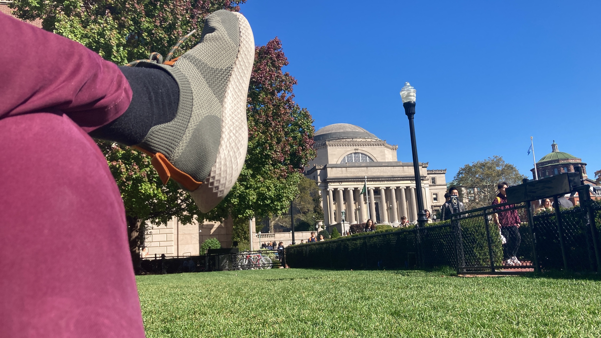

It feels like just yesterday that my plane touched down in the vibrant city of New York. Yet here I am, wrapping up my first semester at Columbia University. Studying at one of the world's top ranked universities in the backdrop of one of the most iconic cities has been an unparalleled experience and I'm excited to share my journey in this blog post.

### Kicking Off the Semester

When I penned [my last blog post](https://www.florsanders.be/posts/nyc2), I was merely a few weeks into the semester. As the MSEE program at Columbia offers students the freedom to craft their own course schedule from a range of electives, my initial two weeks were dedicated to exploring different classes in search of those that resonated most with me. The final lineup was a diverse array of of courses in electrical engineering and computer science, which complemented my background at Ghent University well:

- Neural Networks and Deep Learning

- Deep Learning for Computer Vision

- Sparse and Low-Dimensional Models for High-Dimensional Data

- System-on-Chip Platforms

- Millimeter-Wave IC Design

Throughout September and October, my weeks fell into a well-paced cadence. Each course assigned a homework roughly every two weeks, taking one to two days to complete. This structure ensured a consistently engaged workload without overwhelming pressure, affording me the luxury of enjoying some downtime on the weekends.

Amidst the academic pursuits, I continued to explore the city, relishing the life of a full-time student. The camaraderie with newfound friends in iHouse and Columbia enriched my experience with memorable moments.

- Catching the Yankees vs. Brewers clash at Yankee Stadium

- Cruising the Hudson while enjoying dinner and a dance party

- Indulging in sunlit lunches on the Columbia University campus

- Visiting the Manhattan School of Music and Carnegie Hall for beautiful concertos

- Landing a spot on public radio, courtesy of a WKCR interview

- Reconnecting with nature on hikes in upstate New York

- Peeking behind the scenes at the United Nations headquarters

- The occasional dinner party and board game night at iHouse

These moments, big and small, paint a canvas of joy when I look back on the semester. Initially, I also held tight to my routine of regular runs and gym sessions, clocking a 7.5km run in 45 minutes by November's end. Yet, as the
daylight dwindled, a shift in the rhythm began to unfold.

### The Unfolding Challenge

Taking on a five course workload at Columbia University, rather than the default of four, initially did not seem like a very unusual choice to me, since this is a typical workload in Belgium. However, a reality check was just around the corner.

As the pages of the calendar turned from October to November, the looming midterms added a layer of complexity. In a span of two weeks, the usual cadence of homework assignments needed to harmonize with the need to revisit materials. Luckily, the exams went smoothly, boosting my confidence for the challenges ahead in the semester.

Post-midterms, however, was no time for respite. It marked the onset of the majority of course projects. Like an unrelenting tide, assignment papers flooded in, elevating my workload to the point where every waking hour became a battle to meet deadlines and make meaningful progress in the projects. The weeks of November unfolded as a relentless grind and finding a balance between academic commitments and the rest of life became a formidable challenge.

The end of the month brought a brief hiatus from the academic whirlwind, the Thanksgiving break. A trip to Mississippi promised a taste of the quintessential American holiday. True to my promise to take a break, I explored the Southern US during this week, delving into the historical echoes of the American Civil War, navigating the swamps teeming with alligators and savoring the local cuisine. The week culminated in a delightful Thanksgiving dinner, laden with turkey and an abundance of side dishes. A fitting punctuation to a brief escape of the semester's intensity.

### The Final Sprint

As I touched down in the heart of New York City, the realization dawned
that the semester's end was within reach. A month-long, high-paced
marathon awaited to tie up all loose ends. With each passing day, daylight waned, temperatures dropped and the city adorned itself with twinkling lights to combat the encroaching cold and darkness.

Despite the workload maintaining its momentum from the busting weeks of November, progress on projects and assignments remained steady. Furthermore, Mid-December brought a renewed spirit fueled by the satisfaction of submitting homework assignments for the last time. The last week of the semester demanded a final sprint, studying for two finals and fine-tuning the last details of the remaining projects. Finally, on December 22nd, the very last project concluded, prompting a celebratory visit to Chipotle with my class- and project teammates.

With some distance from the semester the intensity of the past months are gradually sinking in. And while the final grades are still out, I'm already proud of my achievements past semester. I delved into fun and interesting projects, including crafting a Geoguessr-AI for street-level imagery in NYC and exploring neural network architectures to transfer the style and content between jazz and classical music. Additionally, I took on the challenge of building and optimizing a hardware accelerator for a convolutional neural network classifier and designed an integrated receiver circuit for 60 GHz mmWave communications systems. Reflecting on this list, it feels a tad surreal that all these experiences were crammed into a mere sixteen weeks.

### Taking Rest and Looking Forward

As you've likely gathered by now, the upcoming stretch of rest between last Friday and the commencement of the next semester on January 16th is a welcome respite for me. In the weeks ahead, I eagerly anticipate the arrival of my parents and girlfriend, steadfast supporters on this adventure, to the city, where I plan to showcase the myriad wonders that New York has to offer. To escape the city's New Year's bustle (trust me, it's bustling), we've opted for a trip to the country's capital during this period.

While relishing the much-needed rest, I've already begun to daydream about the intriguing courses, projects, and experiences the next semester holds. I'm genuinely excited about the upcoming chapter in this adventure, though I aspire to strike a better balance in my pursuits during part 2.

Wishing you happy holidays and stay tuned for what lies ahead!
