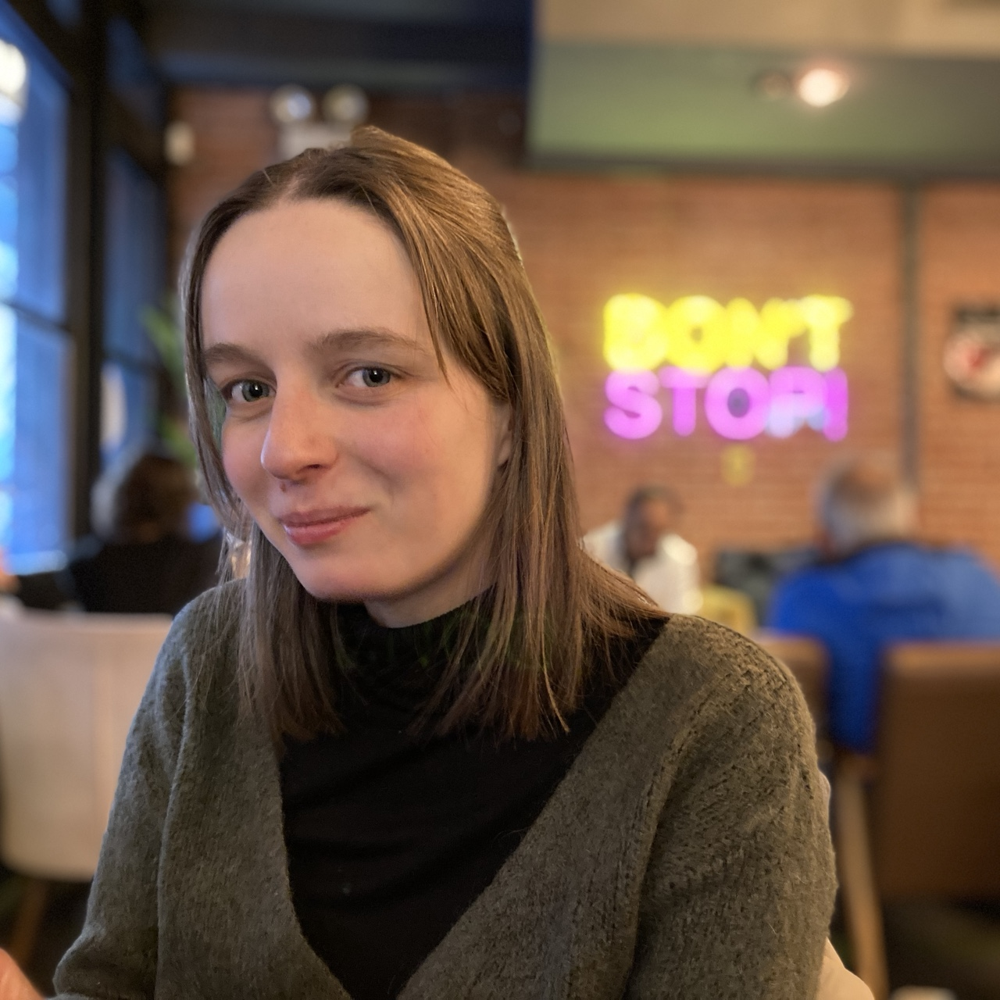

As I wrapped up [my first semester](https://www.florsanders.be/posts/nyc3/) in the vibrant heart of NYC, my mind was consumed by the anticipation of two things. Firstly, the imminent arrival of my girlfriend and parents for a long-awaited visit. Despite the wonders of modern communication bridging our continents, nothing compares to the warmth of a real-life embrace and a face-to-face conversation. Secondly, amidst the whirlwind of my first semester's adventures, I couldn't fathom how the second could ever measure up.

Fast forward to the present, the second semester is in full swing and New York continues to surprise and intrigue me in unexpected ways. Yet, as the gloss of novelty gradually fades, I find myself grappling with the weight of certain urban realities. Join me in this latest installment as I unveil my ongoing journey navigating the highs and lows of life and study in NYC.

### Enjoying the winter break

Following the whirlwind of my first semester, a well-needed break was on the horizon. While I managed to evade burning the midnight oil to meet deadlines, the relentless pursuit of productivity during the semester's second half left me drained. Fortunately, relief was on the horizon as Elke and my parents touched down in the city that never sleeps, ready to explore and rejuvenate alongside me.

Our adventure kicked off with an early morning Amtrak journey to Washington DC, a city with a distinct character set apart from the hustle of New York. Over three days, we strolled through the National Mall and delved into some of the city's many museums and meandering through thee picturesque streets of Georgetown, reminiscent of European aesthetics. Most importantly, we reveled in the joy of reconnection, sharing tales after months of separation. Our trip to DC culminated with a delicious New Year's Eve dinner, marking the dawn of a new chapter.

Come January first, we embarked on the return journey to New York, with a few precious days left for me to showcase the city to my parents. At a blazing pace, we traversed the iconic landmarks, from Times Square to Grand Central Station, and delved into my favorite hidden gems. After a week of shared adventures, it was time to bid my parents farewell once more.

Elke remained by my side for an additional week filled with shared experiences based on recommendations I had eagerly saved up to explore. It felt like living through this fun [Dan Mace video](https://youtu.be/BpqauOpOBTA?si=ijp30B7iEyIAGQk9) I first saw a couple of years ago. Since I lack his cinematic finesse, I will simply list the highlights that colored our days:

- Soaking in breathtaking views from the Summit One Vanderbilt observation deck

- Immersing ourselves in the magic of the Aladdin musical on Broadway

- Scaling the heights of the Statue of Liberty, venturing into her crown

Yet, amidst these grand moments, it was the simple pleasures that
resonated most deeply. From introducing Elke to my newfound friends in
New York to sharing meals and engaging in games of pool, our days were
filled with genuine connection devoid of screens and cameras. Together,
we etched memories that will linger far beyond the semester's end. However, as the two-week fairy tale drew to a close, farewells loomed as Elke left for the airport, cognizant of the months that would separate us once more.

### Kicking off an eventful new semester

With two wonderful weeks with rest, exploration and cherished reunions behind me, the second semester presented itself. The first day of classes unfolded against a backdrop of the season's first snowfall. Seizing the moment, I ventured out to Central Park to sculpt a snowman.

Academically, this semester brings a deep dive into the topics of state-of-the-art deep learning and its convergence with my background in electronics hardware. My course load encompasses five subjects:

- Advanced Deep Learning

- Reinforcement Learning

- Natural Language Processing

- Deep Learning on the Edge

- Embedded Scalable Platforms

Despite only traversing the initial weeks, the lectures, readings and assignments have already proven rewarding, promising to equip me with knowledge and skill that will serve me well for a long time to come.

Beyond the academic sphere, my leisure hours have been spent with friends at iHouse, savoring the entertainment NYC has to offer. Since January 1st, I have gained access to the community kitchen, once again allowing me to pursue culinary explorations and share my love of cooking with friends. Whether we're engrossed in Nintendo Switch games, attending musical
concerts at the Manhattan School of Music, donning VR headsets for
amusing escapades, or simply strolling through the city, there is always something going on. I've come to firmly believe that boredom in NYC is an anomaly, a sign of a missed opportunity.

A recent highlight was soaring through the skies in a small aircraft, tracing the contours of New Jersey's suburbs, gliding past Manhattan's financial district and even skimming over the expanse of Central Park. The memories captured in snapshots evoke a profound sense of awe. This aerial escapade, orchestrated by the skilled pilot and fellow Columbia Engineer [Basile Van Hoorick](https://basile.be/about-me/), elevated my experiences to unprecedented heights.

Just last week, I had the joy of welcoming my brother and sister to New York. Together, we wandered through the streets of Williamsburg, hunted for treasures at L Train Vintage thrift store and enjoyed the beautiful weather in Central Park. The reunion felt as if mere days had passed since we last saw each other and the time spent together was nothing short of a blast.

### Beyond rainbows and sunshine

In recounting my time in New York, I have reveled in its wonders and embraced its vibrancy. Truly my experiences have surpassed any preconceived expectations. However, it would be disingenuous to paint life in the city as an endless parade of rainbows and sunshine. Wanting to share my full experience, I feel compelled to shed light on the lesser-discussed facets of life in the Big Apple.

Amidst the grandeur of the city, there are some irksome facets that punctuate the daily routine: the short days with uninviting weather during the winter months, coupled with pockets of urban neglect, scurrying rodents and cockroaches and the omnipresence of tourists during the holiday seasons. Yet, it's the pervasive issue of inequality that casts the longest shadow over New York City.

In a city boasting a [millionaire population exceeding 340,000](https://fortune.com/2023/04/18/new-york-worlds-wealthiest-city-sunbelt-states-growing-fast/) fueled by the business people in the financial district and the occupants of billionaires row, the extremities of inequality are glaring. The most telling manifestation of this imbalance is the burgeoning homeless population, [surpassing 100,000 last summer amid a migrant crisis](https://www.nytimes.com/2023/06/28/nyregion/nyc-homeless-shelter-population.html) . Comparing these statistics with Brussels, where [homelessness has also reached a critical point](https://www.brusselstimes.com/678541/breaking-point-homelessness-in-brussels-goes-from-bad-to-worse), reveals a staggering 3.4 times higher rate of homelessness per inhabitant in New York, all made worse by the ongoing [US opioid crisis](https://en.wikipedia.org/wiki/Opioid_epidemic_in_the_United_States). With [one in nine school children experiencing homelessness](https://www.nytimes.com/2023/11/01/nyregion/homeless-students-nyc.html), the magnitude of this crisis defies comprehension.

Beyond the numbers, it is the human experiences that encapsulate the
true essence of these challenges. Every exploration of the city brings
encounters with individuals grappling with hardships – be it musicians
playing in the subway, snack vendors, or individuals kneeling in
desperation. Three personal encounters serve as testament to the depth of this issue.

My first shock-and-awe moment unfolded during my first week in the
city. It was the last night of my stay at a Brooklyn Airbnb, just before moving into the International House. After a day spent on campus and a serene sunset cruise aboard the Staten Island ferry, I descended into the subway for my journey home. As I emerged onto the street, I encountered a man, in the throes of substance abuse, nodded off just outside my residence. Strangely, mere meters away, patrons of a nearby café blissfully enjoyed their cigarettes, seemingly indifferent to the unfolding scene.

As the semester progressed, the holiday season ushered in another
poignant encounter. Venturing into midtown to bask in the festive glow
of Christmas decorations, my companions and I bore witness to a man
collapsing on the subway platform. Time seemed suspended as bystanders
grappled with uncertainty. Eventually, two brave souls approached to help them man, recognizing the signs of a potential drug overdose. Just then, our train arrived, and like others, we boarded, leaving behind a scene fraught with unanswered questions.

Most recently, a routine grocery run exposed me to the harsh realities of survival in the city. A man, driven by hunger, attempted to steal bags of chips, only to be chased by store security. Caught in a desperate situation, he faced not only apprehension but also the degrading force of pepper spray. While theft is no solution, witnessing this act of desperation was a stark reminder of the unforgiving landscape that defines life for many in New York.

Such encounters are part of everyday life in New York, and I'm certain each resident has a similar narrative to share. Following each incident, I scour the internet for ways to help, only to confront the harsh reality that, amid a hectic schedule and limited resources, acknowledging their existence and extending occasional acts of compassion remains the extent of what can be done. The most hopeful message I encountered is found in [Björn Soenens' recent podcast episode on the topic of Homelessness in the USA](https://www.vrt.be/vrtmax/podcasts/vrt-nws/b/bjorn-in-the-usa/1/het-hemelhuis-van-salt-lake-city/).

### Looking forward

As the countdown to the double-digit days remaining in my US studies begins, a sense of anticipation lingers for the unfolding weeks and months. Along with the promise of lengthening days and improving weather, the next wave of assignments and projects is slowly gaining momentum. Yet, amidst the whirlwind of academic demands and the ebb and flow of daily life, one certainty remains: I will fondly reminisce about my time here. Each day, each challenge, and each triumph has woven itself into the fabric of my journey, enriching my experience as a student in New York City. As I embrace the uncertainty of the days ahead, I am filled with gratitude for the memories already made and the adventures yet to unfold.
