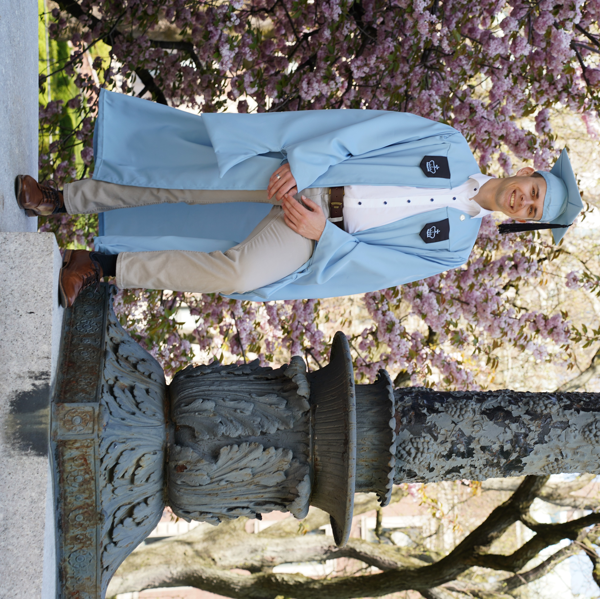
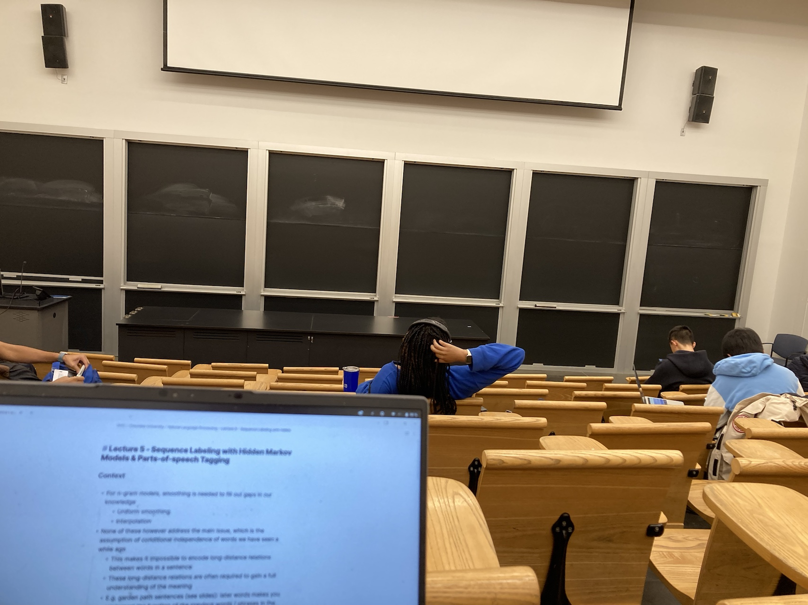
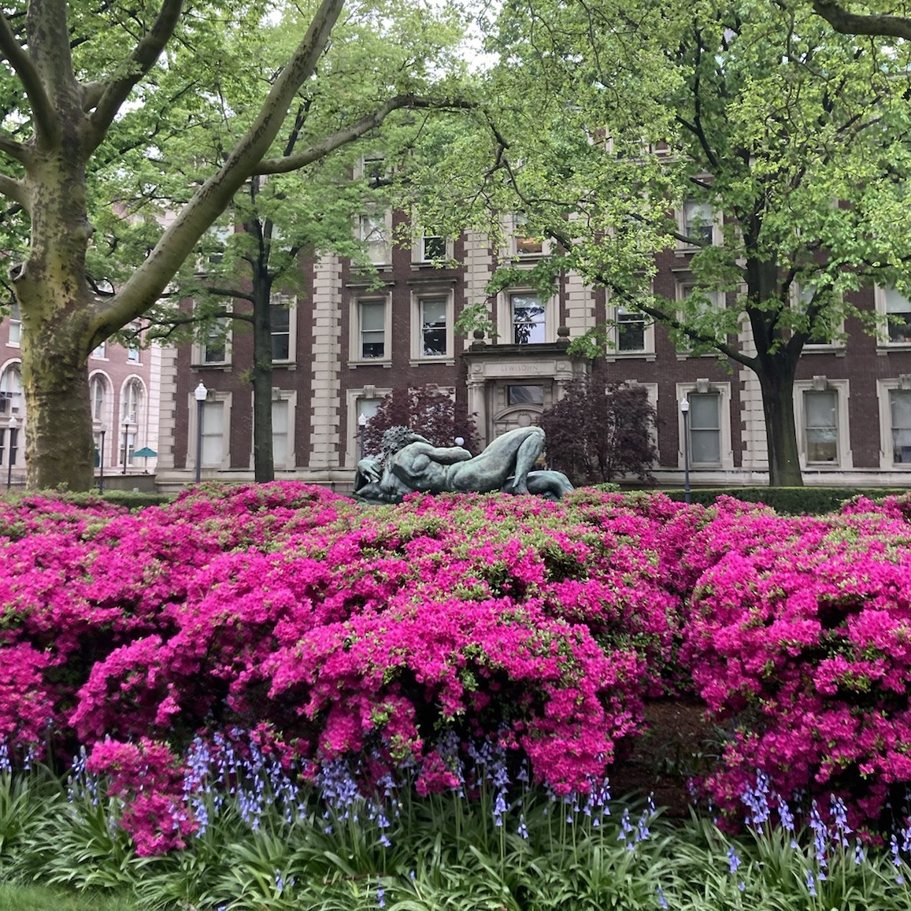
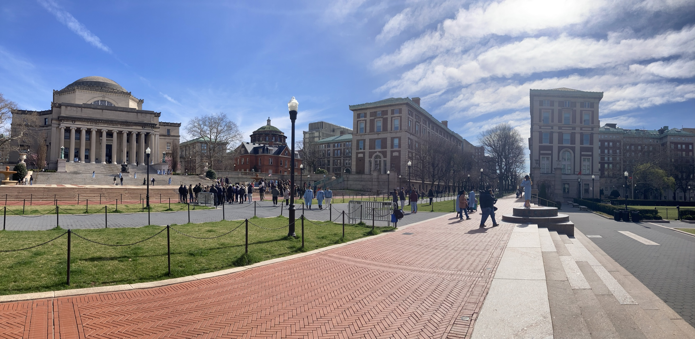
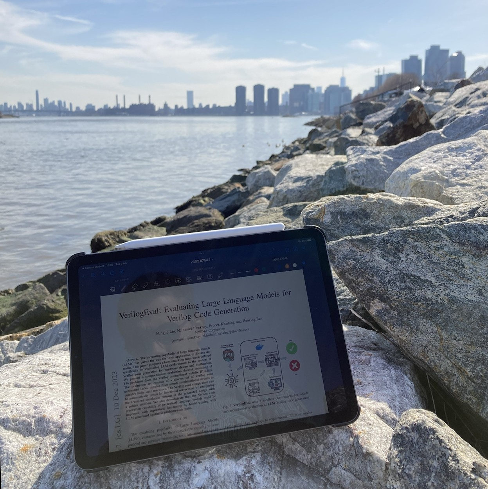

A little over two years ago, on June 7th, 2022, I made the decision to pursue further studies in the United States by applying for a scholarship through the [Belgian American Educational Foundation (BAEF)](https://baef.be/). Following a rigorous application process involving BAEF and several top US universities, I received significant news on January 4th, 2023.
An email from Columbia University lit up my screen, adorned with digital confetti, announcing my acceptance into their graduate electrical engineering program. Shortly after, a letter from BAEF arrived, extending congratulations on being recommended for a generous $60,000 scholarship to support my studies in the US. This marked the beginning of an extraordinary journey: living and learning in the vibrant city of New York.

Over the past nine months, this adventure has unfolded and I have shared my experiences along the way.
Today, I stand as a graduate of Columbia University, filled with pride for what I have accomplished. As I prepare to bid farewell to NYC and return to Belgium to reunite with friends and family, I feel compelled to reflect on my experiences and address some recurring questions I was asked during my time here:

- How does my experience at Columbia University compare to that of Ghent University?
- Are the courses as challenging as they're reputed to be?
- And ultimately, was it all worth it?

Curious as well? Join me as I delve into these inquiries and offer my two cents.

### Just A University...

At first glance, Columbia University might appear no different from any other university. It's understandable to hold such a perception. Students attend lectures, complete assignments throughout the semester, and face final projects and exams. But upon closer examination, nuances emerge.

Ghent University operates on 12-week semesters with a month-long exam period, whereas Columbia University extends its semesters to 14 weeks with a mere two weeks designated for exams. Furthermore, the timing of course projects differs significantly; at Columbia Engineering, projects are typically due at the end of the exam period, unlike Ghent University where they are to be submitted before exams commence.
As a consequence, the program at Columbia puts more emphasis on projects than exams as a means of final evaluation. In my opinion, this makes a lot of sense in an engineering master.

Another notable contrast lies in the distribution of workload types. Despite a seemingly light load of approximately ten weekly lecture hours in a standard full-time package, Columbia's program is far from easy.
Much of the learning is self-directed, with students expected to engage in extensive reading and problem-solving independently. The avalanche of assignments serves to reinforce this self-guided learning approach, with students encouraged to seek clarification during office hours when needed.

Lastly, there's the aspect of academic freedom. Ghent University's MSEE program spans four semesters, comprising mandatory coursework and elective courses, alongside thesis research. In contrast, the program at Columbia spans three semesters, entirely comprising elective courses. While certain graduation requirements and recommended specialization tracks exist, students are generally free to mix and match courses in alignment with their interests and ambitions.
Moreover, many of the course projects I participated in allowed for substantial flexibility, with students collaborating with professors and teaching assistants to determine project topics and scopes.

### ... Or Is There More Than Meets The Eye?

While the differences in program implementations offer interesting insights, they only scratch the surface.
Columbia University's promotional materials would have you believe that it transcends other insitutions, that there is an ineffable essence making studying at an Ivy League Institution inherently more rewarding.
While I advise taking such marketing rhetoric with a hefty dose of skepticism, it wouldn't be such a compelling story if it weren't based on some truths. Let's delve deeper into what lies beneath.

To begin with, Columbia's picturesque Morningside campus plays an important role in shaping its narrative. A leisurely stroll through its meticulously tended gardens, past grand neoclassical library buildings and numerous statues, instills a sense of being in a place of significance.
But, of course, that is just the packaging. The true quality of a university, or any other institution for that matter, lies in its people and the ideas they bring forth.

I want to emphasize that neither of the engineering schools at Ghent University and Columbia University are lacking in this aspect.
Both institutions are filled with bright, driven individuals — students, researchers, and lecturers alike. This is hardly surprising, given the inherent demand for motivation in pursuing an engineering degree, regardless of the institution.

What sets Columbia University apart is the ambition of its community. Many of the engineering faculty whose courses I've enjoyed boast successful startup ventures or remarkable industry experience alongside their academic pursuits. Similarly, the students I've collaborated with harbor similar aspirations and actively work towards realizing them. Coupled with the substantial funding available for research, it makes the impossible feel possible.
Ghent University taught me to "Dare to Think", and Columbia University challenged me to dare to dream bigger.

### It's What You Make Of It

In the first half of this blog post, I underscored the significant freedoms afforded to students within Columbia EE, allowing them to tailor their academic journeys to align with their interests and passions.
I explained how the campus environment and the people that roam there inspire motivation for those open to it.

However, it's essential to acknowledge the flip side of this coin. Merely granting students autonomy in shaping their academic pursuits doesn't inherently ensure successful learning outcomes. Without adequate guidance and a cohesive plan, students may become unguided missiles, constructing curricula devoid of cohesion. Worse still, some may be tempted to optimize their studies for minimal effort.
Consequently, the experience of studying at Columbia University is what you make of it.

For those contemplating pursuing studies at an esteemed institution like Columbia, I advocate adopting the mindset of a disobedient youth, as described by Kierkegaard.

> A disobedient youth is no longer in fear of his schoolmaster - the relation is rather one of indifference in which schoolmaster and pupil discuss how a good school should be run. To go to school no longer means to be in fear of the master, or merely to learn, but rather implies being interested in the problem of education.

Focus on the problem of your education, make selections of courses which will allow you to gain a deep and broad understanding of the field you wish to master. Talk to your professors and teaching assistants and read the materials to figure out where the gaps in your knowledge and skills lie and use this information to figure out what course projects are most pertinent to your growth. In my experience, prioritizing learning about what interests you, for nothing but its own sake, is the most effective way to find the drive, drive and discipline required to perform the actual work. The grades don't matter too much, they will follow.

Throughout my academic year at Columbia, my primary objective was to immerse myself in the realm of modern AI. Given my prior specialization in communication and information technology, my initial understanding of deep learning was rudimentary at best.
However, with each passing class and project, I delved deeper into various facets of modern AI. Among my endeavors, I undertook the creation of:

- A [GeoGuessr](https://www.geoguessr.com/)-style minigame set in NYC, employing transfer learning on computer vision CNNs to beat human performance.

- Generative VAEs and GANs to automatically transcribe musical compositions between the jazz and classical genres.

- An on-chip deep learning model geared towards optimal quantum control for microwave cavity qudit devices.

- Reinforcement learning models (DQN, Actor-Critic) programmed to play chess on a hexagonal board.

- An advanced computer vision pipeline for extracting 3D player poses from tennis game footage, utilized in a custom architecture featuring GNNs and RNNs for downstream classification tasks.

- An offline-first voice assistant, leveraging open-source voice processing models and incorporating a local LLM at its core.

Admittedly, these projects did not have a 100% success rate in terms of final results. For example, our AI chess engine was unable to beat our own hand-developed algorithm. Where these projects did not fail, however, was in learning outcome. The insights we obtained by grinding at the implementations far surpasses what we could have achieved by more passive engagement with predetermined lectures and assignments.

### Is It Worth It?

Seemingly such a simple question, but I do feel like it cannot be answered without the context provided in this article.
To give a final assessment, one must factor in the obvious element of tuition costs.
Priced at $2,462 per academic credit, with additional charges for health insurance and fees, Columbia University charges an eye-watering $82,256 for the 30 credit graduate engineering program.

Luckily, I was able to count on a 25% tuition fee waiver from the EE department along with a $2,500 [EE Tesla Scholarship](https://www.ee.columbia.edu/nikola-tesla-electrical-engineering-scholar-program), in addition to the financial support from [BAEF](https://baef.be/), for which I am profoundly grateful.
Like myself, many students at Columbia can leverage some form of scholarship or financial assistance, substantially reducing the average annual cost of education to [$12,411](https://bigfuture.collegeboard.org/colleges/columbia-university/tuition-and-costs).
At this price, there is a much better case to be made to enjoy the world-class education that Columbia has to offer.

But what if a scholarship or financial aid is not available?  
Prior to my studies in NYC and my conversations with fellow students who navigated these dilemmas, I would have claimed there is no way that it could make any sense.
However, fresh insights have compelled me to acknowledge one exception.
For those with the ambition of pursuing an engineering career at a leading US tech firm, a Columbia degree appears to enhance prospects for securing internships that can lead to full-time employment.
With the lucrative compensation packages associated with such roles, the student loans incurred during the graduate program could be paid back within a reasonable timespan.
However, this is a bigger wager and I'm still unsure if I would be comfortable taking it if I were in this situation.

Looking back on my year of studies in NYC, I can certainly conclude that it has proven more than worthwile for me, both in terms of academic enrichment and personal growth in a fast-paced international environment.
Keep an eye out for my next blog post, where I will share some final reflections about my experiences studying in NYC.
