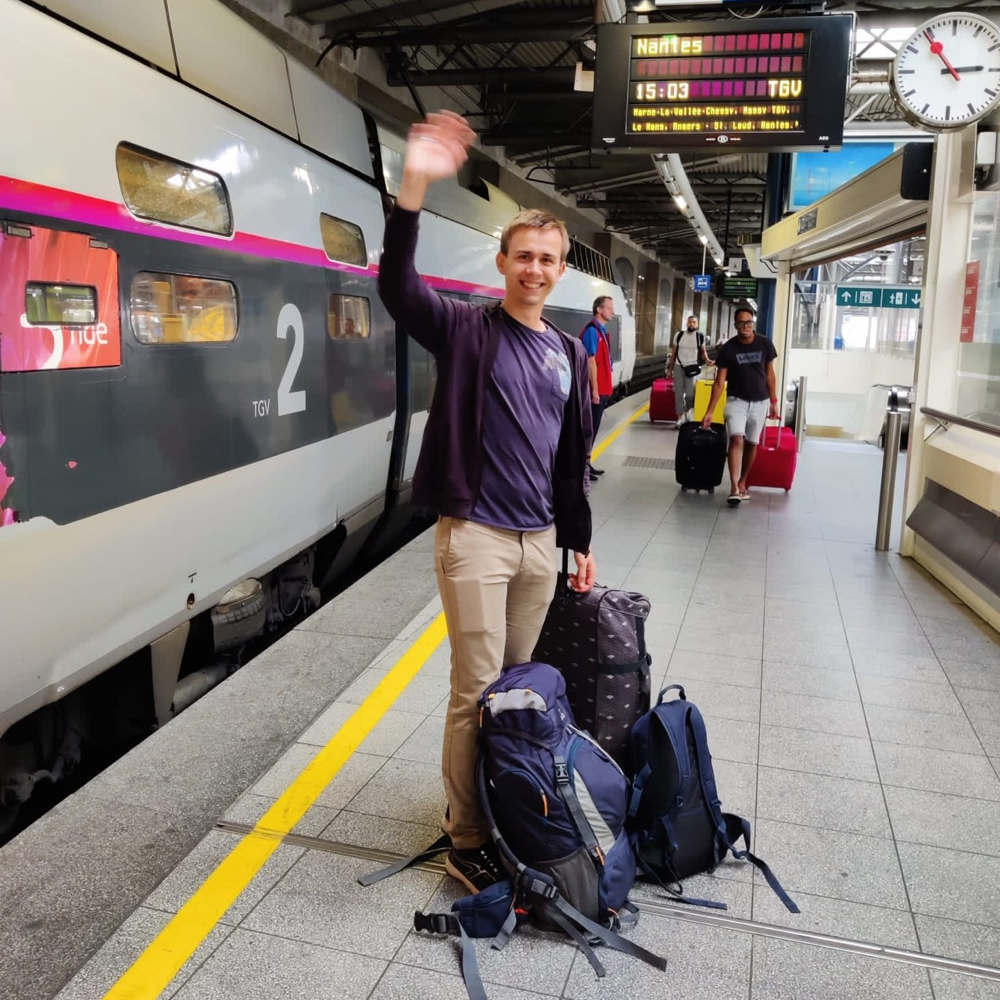
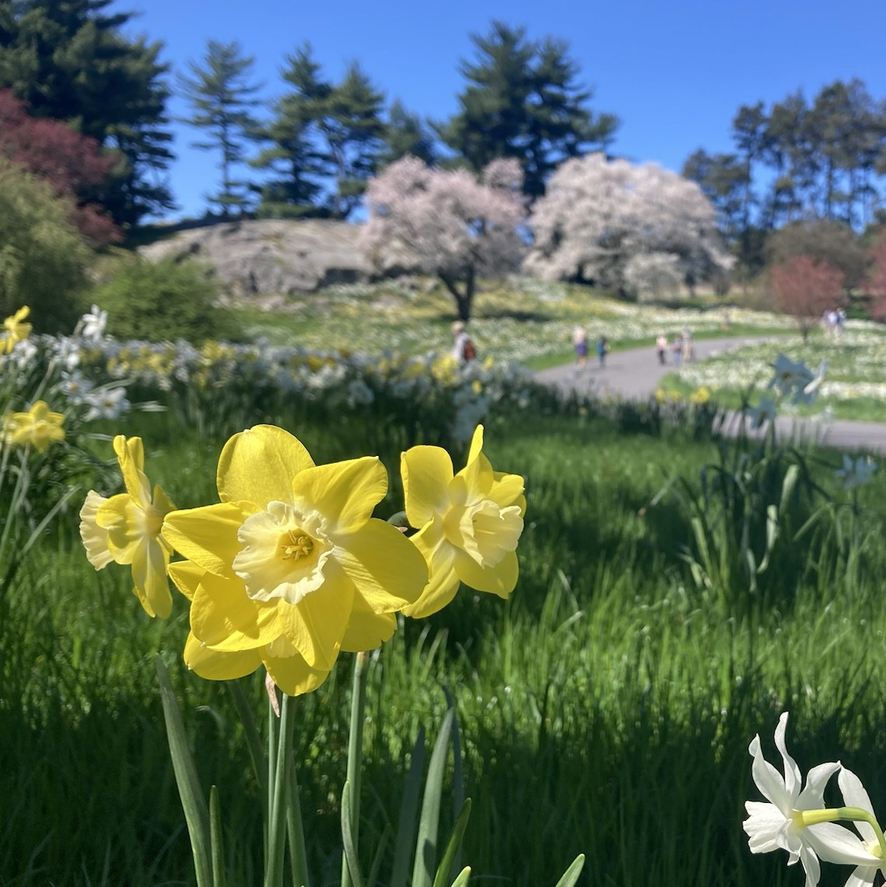
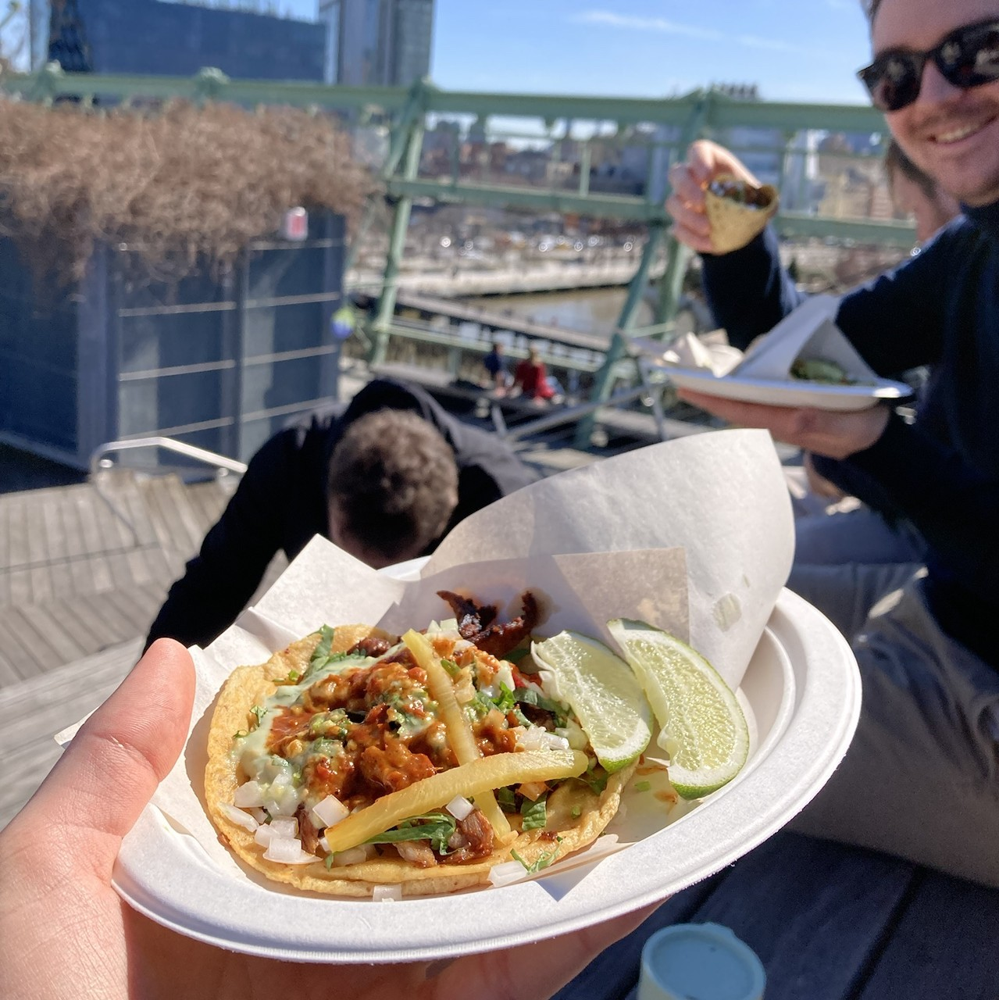
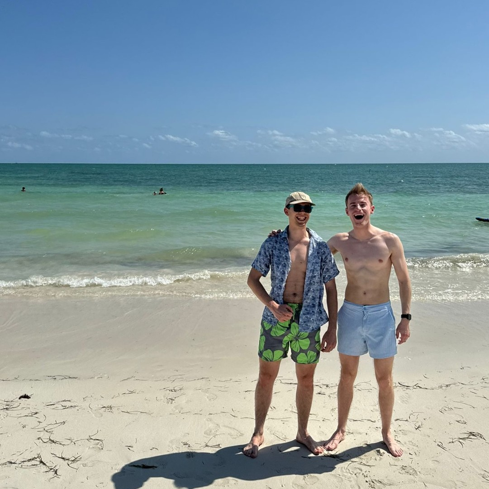
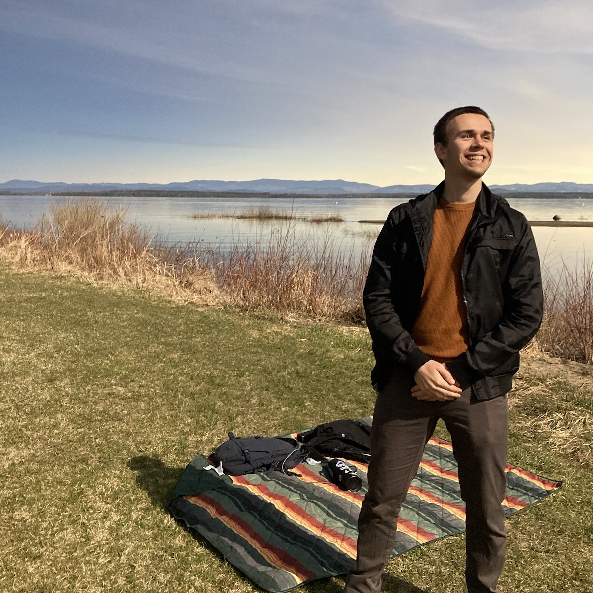
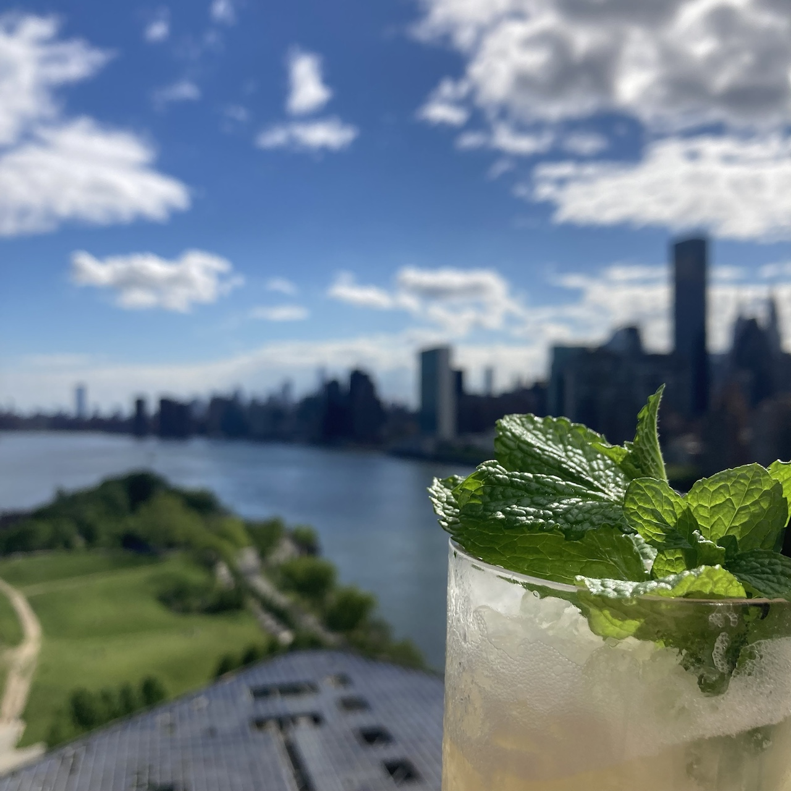
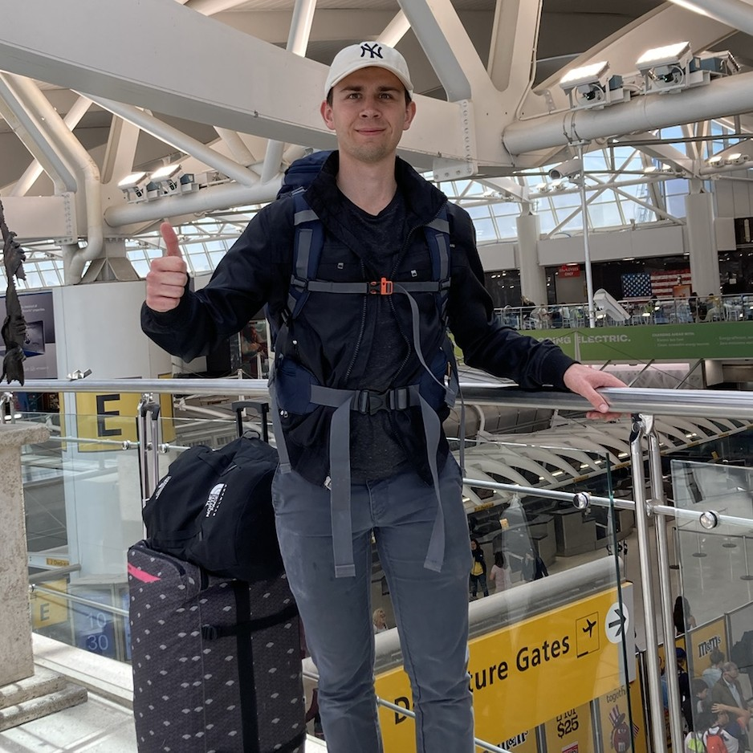

Exactly one year ago today, I left the familiar comfort of Belgium and embarked on the wildest adventure of my life. With my entire world packed into two suitcases, I said goodbye to my girlfriend and family and boarded a plane bound for New York City. Time has flown by, and what once felt uncertain has now become memories I cherish.

From the start, I’ve taken you all along for the ride, sharing what I’ve seen and felt as I navigated New York’s incredible experiences, along with the tougher realities of the city’s relentless pace. One last time I will share with you a piece of this journey, as I reflect on my last 100 days of living life on fast forward.

### Making Plans for New York Spring

As the countdown to my final 100 days in NYC began, my siblings had just wrapped up their visit, and the second semester was in full swing. Reflecting on the pre-Christmas crunch from last semester, I was determined to strike a better balance between work and play this time. My plan was straightforward:

1. Assess the workload for upcoming projects, assignments, and exams for the rest of the semester.
2. Start early on whatever I could to get a head start.
3. Coordinate timelines and planning clearly with my project teammates.
4. Prioritize and fully enjoy downtime without stress or guilt.

A few weeks of gloomy weather early on gave me a perfect window to focus on assignments and get ahead. But spring was just around the corner. As Professor Carloni had warned me, New York City transforms into something magical once the parks burst into a million shades of color. Fortunately, I managed to balance my workload well, allowing me to savor the city’s springtime wonders. Here are a few recommendations based on my own adventures:

- Wander through the Bronx Botanical Garden and its Brooklyn counterpart. They offer colorful escapes from the city bustle and are breathtaking when everything is in bloom.
- Grab some tacos from Los Tacos No. 1 at Chelsea Market and enjoy them at Pier 57 Rooftop Park across the street.
- Pick up a book at Strand Bookstore and ride the F-train to Roosevelt Island to read by the waterfront.
- Get some laughs in the audience of a late-night talk show. I managed to see both _The Tonight Show_ starring Jimmy Fallon and _The Daily Show_ with Jon Stewart — the latter definitely took the cake for comedy.
- Speaking of laughs, catch a show at the Comedy Cellar. Even if you don’t recognize the names on the lineup, you’ll be surprised by how funny they are.
- Sip cocktails from a tea cup at The Backroom, a hidden speakeasy still operating from Prohibition days.
- Rainy Day? Stroll through the MoMA, the Whitney, or the MET and immerse yourself in some of the greatest (and latest) art humanity has to offer.

All of these are tons of fun!
Especially with friends — whether new ones or visitors from Belgium — to keep me company and distract me from the constant churn of assignments.

### Living the Spring Break Life

Attending a university in the U.S. during spring inevitably means experiencing Spring Break. Just like I did for Thanksgiving in the first semester, I wanted to embrace this tradition in the most American way possible. So, I hopped on a plane straight to Miami Beach and the Florida Keys. While the all-night frat parties don’t hold much appeal for me anymore, the warm weather and stunning beaches provided the perfect backdrop for an instant holiday vibe.

During the midweek trip, we cruised around the city in a rented Hyundai Elantra—a smooth, sporty ride that added to the cinematic feel of the whole experience. Driving itself was an adventure as I adjusted to the local road culture, which took some getting used to. But in this case, the destinations were far more important than the journey. Each stop offered something unique: from standing at the southernmost point of the mainland USA to savoring fresh fish tacos. I even got to channel my (questionable) artistic side by creating my own graffiti at the Wynwood Walls street art museum.

Those five days in sunny beach paradise were just what I needed to recharge for the second half of the semester.

### Awestruck by the Power of Nature

One unsuspecting morning, during a guest lecture for my Natural Language Processing course, something unexpected occurred. The ground started to shake. Initially, it was as if a heavy truck was rumbling by, but it quickly intensified until it was impossible to ignore. Just as suddenly as it began, the tremor faded, leaving us confused and wondering what had just happened.
Moments later, we learned that a 4.8-magnitude earthquake had struck neighboring New Jersey. Aside from a brief moment of confusion, no damage was done. Ironically, news of the quake traveled faster than the shockwaves; within a few hours, it had made the [front page of Belgian newspapers](https://www.vrt.be/vrtnws/nl/2024/04/05/aardbeving-new-york/).

Just three days later, a total solar eclipse was set to pass over the Adirondack Mountains in upstate New York. While the eclipse would be visible from the city, it would only be partial, offering a limited experience. A friend from International House mentioned he was planning to drive up to the Canadian border to witness the eclipse in its full glory. As luck would have it, I had no classes that day and was ahead on assignments, so I decided to join him. We spent 10 hours in the car for three minutes of totality, but it was worth every moment. The experience was unlike anything else—birds fell silent, and the sky took on the eerie glow of a 360-degree sunrise as it grew darker and darker, holding everyone’s attention. When the sun was fully eclipsed, the crowd, ourselves included, couldn’t help but gasp and cheer in awe.

These two events, happening so close together, pulled me right out of my busy routine and reminded me that no matter how caught up we are in our lives, nature always has a way of humbling us with its power and beauty.

### Graduation and Leaving NYC

My final month in New York was honestly a blur. During those thirty days, my classmates and I scrambled to finish all our assignments, projects, and exams for the semester. Before I even received my grades, it was already time for the graduation ceremony. Unfortunately, due to ongoing political tensions on campus, the graduation events were scaled back to just the class day ceremony at Baker Field football stadium. Wearing the official gown, hearing my name called, and walking across the stage marked my final act as a student at Columbia University. I was officially a graduate.

Then, the time had come to start packing. Just as I had arrived in New York, I packed all my belongings into a couple of bags. In my final 24 hours, I went for drinks with friends at a rooftop bar overlooking Roosevelt Island’s Four Freedoms Park — a spot that had easily become my favorite in the city — had dumplings at Nom Wah Tea Parlor, spent one last night in my tiny (9 m²) Manhattan student room, and then headed to the airport. It wasn’t until I was on the plane, with a layover in Copenhagen, that it really sank in: it was all over. I was heading back home.

The opportunity to study in the United States was nothing short of incredible. My year in the Big Apple broadened my perspective in ways I never could have imagined. The knowledge I gained at Columbia, the insights from conversations with fellow residents at International House, and the countless observations made simply walking through the city are difficult to put into words. On top of that, the people I met during this time inspired me to stay curious and keep connecting with new faces. I hope some of the friendships I made will last for years to come.
I feel extremely fortunate to have had such a wonderful experience and am deeply grateful to everyone who made it possible: [BAEF](https://baef.be/), my parents, family, friends, and my girlfriend. Without their support (and patience), this journey would have been impossible.

When my flight landed in Belgium, my parents and girlfriend were already waiting for me at the airport. The hours, days, and weeks that followed were filled with joyful reunions and endless stories of our time apart. But even as I settled back in, my next adventure was already on the horizon—but that’s a story for another time.
