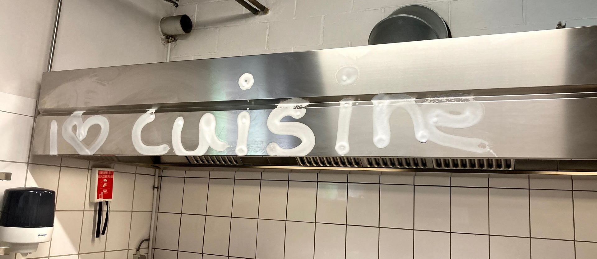
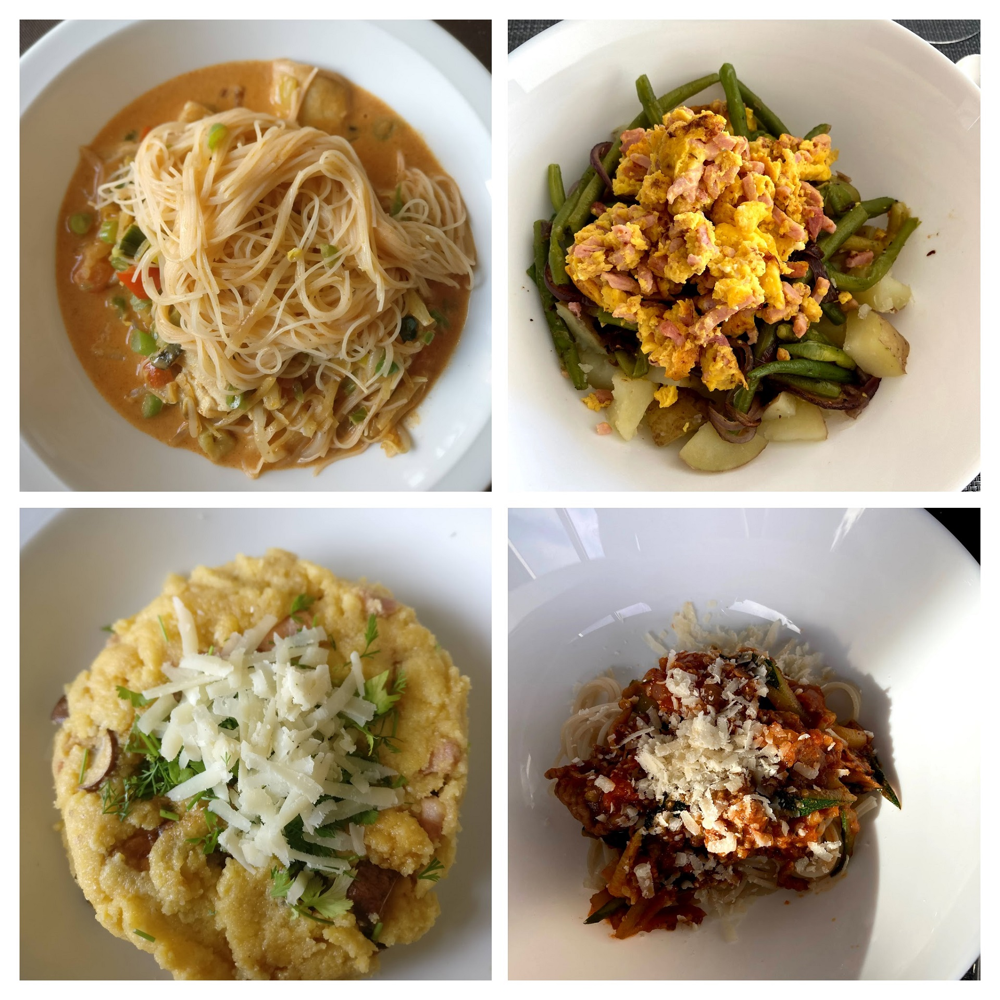
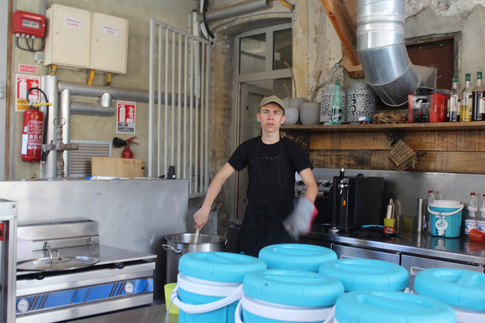
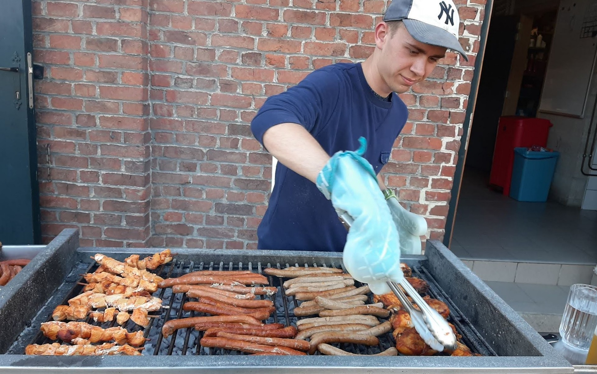
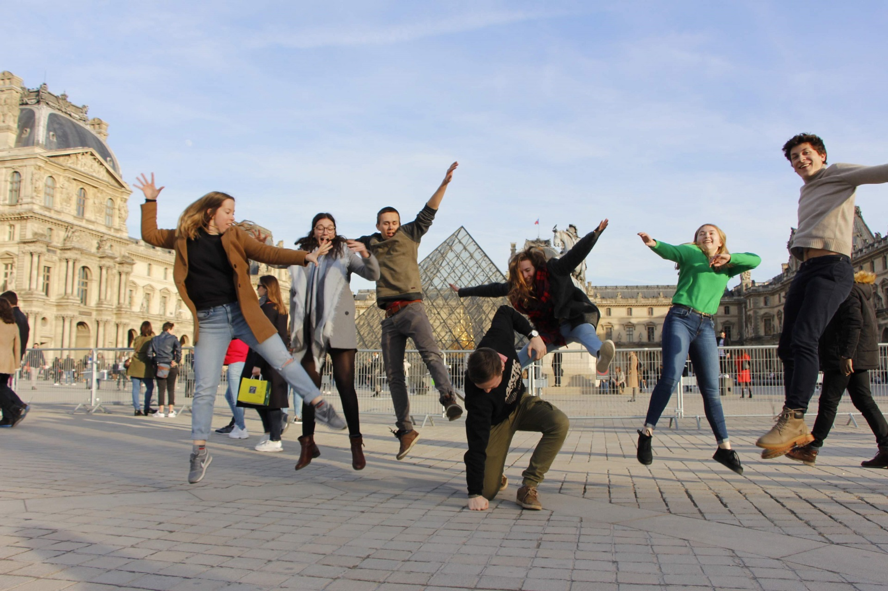

For the past six years I have been doing volunteering as a cook at Clip  Taalvakanties, which organizes summer camps to teach Flemish youth  either French or English using an active approach: The participants have to use the foreign language as much as possible for the whole duration  of the camp, in essence taking a "language bath". Unsurprisingly, for a  lot of people this approach yields vastly superior results compared to  studying from a textbook.

Starting out as a participant myself, barely knowing my way  around a kitchen, I certainly learnt a heck of a lot working in one,  eventually being able to take up management for a kitchen crew myself  and assist in the formation of new cooks. In this article I want to  explore what I've learnt by spending this time volunteering, since I  believe there's actually quite a bit to unpack.

## Technical knowhow

By spending time working in a field initially unknown to me, speaking French rather than my mother tongue I obviously gained a lot  of technical knowhow.

First off is language. While my grammar and vocabulary might not be up  to par with people that were raised bilingually, most of the time I'm  able to express myself in French quite fluently.             Even though in Belgium French is taught from a very young  age in schools, as early as primary education, I don't think I could  have developed this level of comfort with the language without the  practice offered by these camps.

 I ♥ cuisine, painted with cleaning product by one of the cooks in my team.

Additionally, I learnt how to cook. Before these camps I enjoyed baking a cake or making cookies every now and again, but I never strayed far  outside of that. Nowadays I'm able to whip together a tasty and healthy  meal for myself (and some friends) in 30-45 minutes at a third the cost  of takeaway. To be fair, this took a bit of learning and experimenting on my own time, but the vast majority of knowledge and techniques are  things I acquired during those weeks at Clip.

 Four of the dishes I prepared at home most recently.

While both of the skills discussed above have already proved immensely useful, they're only the tip of the iceberg. In the next two sections I discuss two more categories of  lessons resulting from my summer camps which might be a bit more subtle  but carry even larger consequences.

## Productivity enhancers

As a cook I started out simply following others, letting  others do the thinking for me. In the beginning this worked fine, since I still had so much to learn about the technical aspects. As these improved, I gradually started taking up more  responsibilities: taking diets and food allergies into account, making  sure the kitchen meets health codes, thinking about portion sizes,  keeping an eye on timing.

Doing so, I picked up a thing or two about work ethic,  productivity and even management. In this section the three lessons that stuck most with me are listed, along with examples of how I apply these in real life.

### 1. Work hard, rest well

In the kitchen, it's very easy to identify when your work is done. If the meals are prepped, the dishes are done and the kitchen is  clean, you can close the doors. By focusing on the task at hand and working hard while doing so, it's possible to create more time for leisure activities seemingly  out of thin air. Extending the leisure time results in feeling more refreshed when picking the work back up, in turn making it easier to work hard  again. Truly a self-amplifying mechanism.

 Me in full action, barely noticing someone is taking a photo.

I built an intuition for this by working as a cook, but the  full realization of the effectiveness only came to me after reading [Deep Work](https://www.calnewport.com/books/deep-work/) by Cal Newport. Whenever possible, I try to use this technique in my daily  life as well. I strive to work for shorter periods with intense focus,  taking breaks when I feel my attention starts to dwindle. I believe this is the most effective way of achieving the  results I desire without wrecking myself trying to do so.

### 2. Lead by example

While productivity tips such as the one above are excellent  tools for individual work, working in group effectively requires more  than just that. During the weeks I got to manage a kitchen crew myself I got to see the effectiveness of leading by example in practice.

Leading by example means "putting your money where your  mouth is" in the context of your work.            By bringing a lot of energy and having a good work ethic  myself, my fellow cooks seemed to take little issue with my proposal to **work hard and rest well**. In comparison, at moments I was less present myself I  noticed how the energy levels of the group seemed to drop accordingly.          

Of course some of this might just be correlation rather than causation and there are certainly limits to the effectiveness of this  technique. Therefore I would advise to combine it with other  motivators. For example, I tried to make the leisure time created by  working hard somewhat special as often as I could to ensure they're  something to look forward to.

 Working hard at my barbecue, absolutely owning it.

### 3. Own it

Whatever you do, own it. And encourage others to do the  same. Ownership is in my opinion the most powerful when it comes to  achieving things and makes working in group much easier.

Taking ownership entails much more than simply **taking responsibility**. Besides applying the principle of **dividing and conquering**, you give people control over the project: developing a strategy of how  to achieve the goal and trying to overcome hurdles along the way. You make them **think for themselves**. As a result, the feelings of involvement and independence  rise significantly and success for the project becomes a personal  victory, however small the achievement.

The best example I can think of is the week's last cooking  workshop, an activity where the participants come and help prepare that  day's meals, at one of the camps I did last year. I gave two of my cooks full control over the organization  and only told them I would like the appetizers for the evening to be  done by the end of it. And boy did they deliver. In the timespan of one hour they  managed not only to finish the appetizers, but to prepare a crumble and a rainbow cake among other things for the dessert buffet as well.

## Interpersonal skills

 At summer camp one meets people who have trodden many  different walks of life, in essence expanding the "little village" of  people you know beyond those who live in your neighborhood or the ones  you study/work with. This allowed me to grow from a shy and socially awkward kid  to the more self-confident and openminded person I am today.

Spending time with my fellow cooks and co-camp counselors  and interacting with participants played a big role in this evolution. Besides just being more sociable and extraverted than I used to be, I also find my capacity for empathy has grown, I'm more trusting and better able to hold conversations, even difficult ones if  necessary.

 Group picture at the Louvre, Paris.

It is often said between Clippers (as we call ourselves)  that by joining the organization, you also join a second family. I tend  to agree. After these six years, among my closest friends are some of  the people I met during these summers. They are people I can have incredible fun with and I trust  would have my back should times of need arise. Since I would've had little chance of meeting them if not  trough Clip, they are the reason I'm most grateful for signing up to volunteer six years ago.