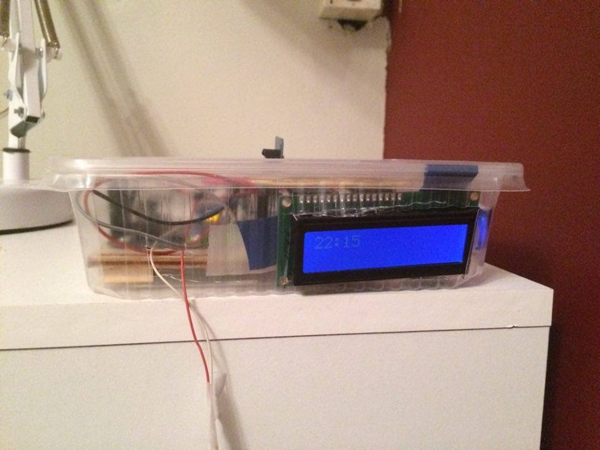
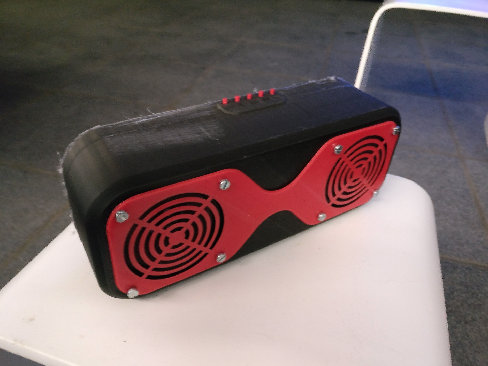
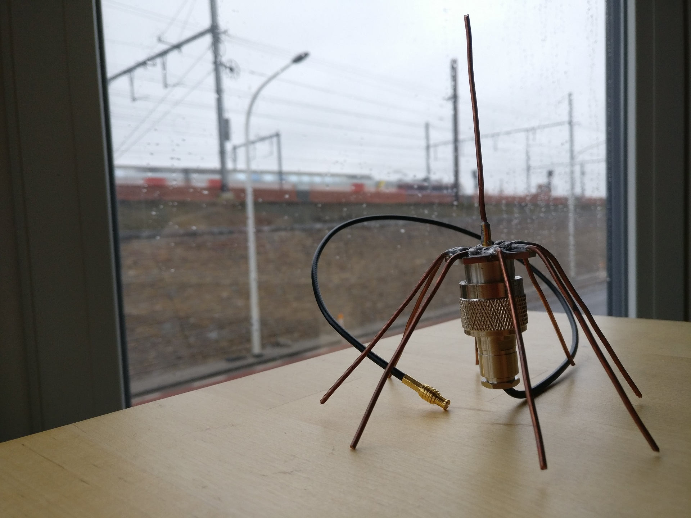
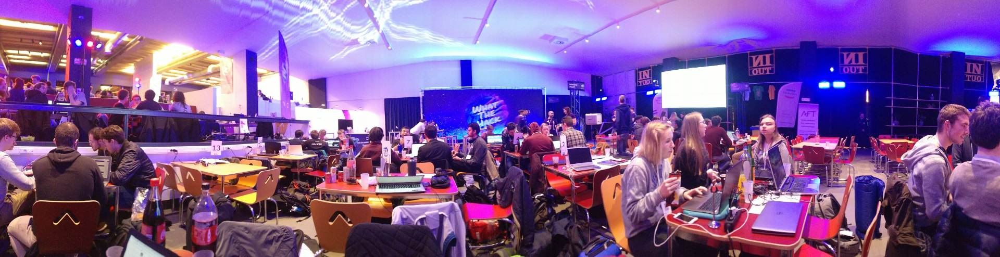
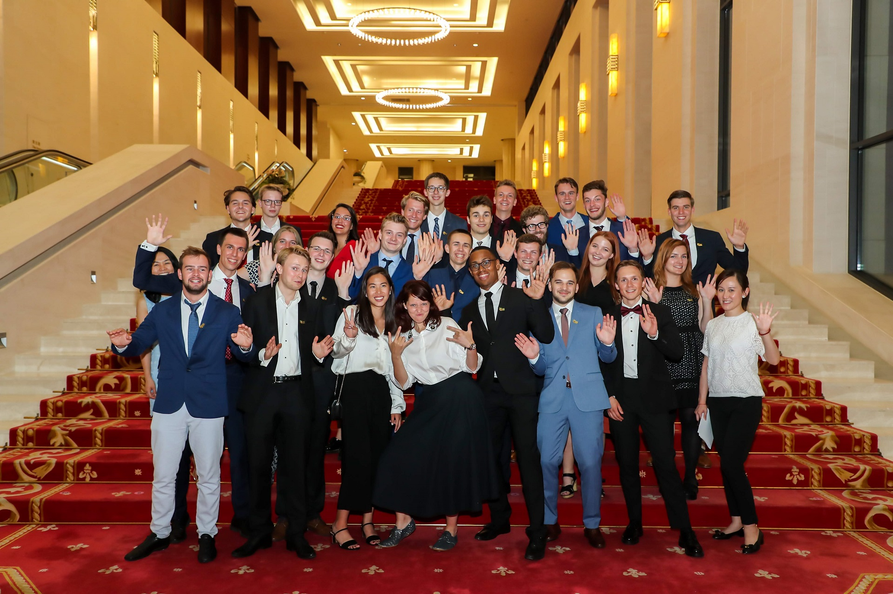
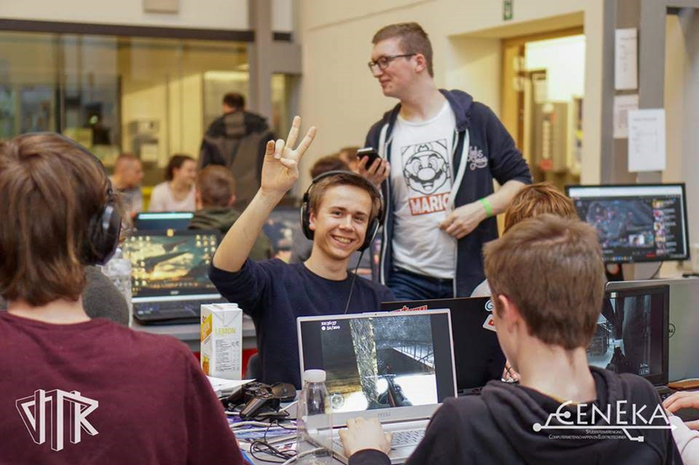
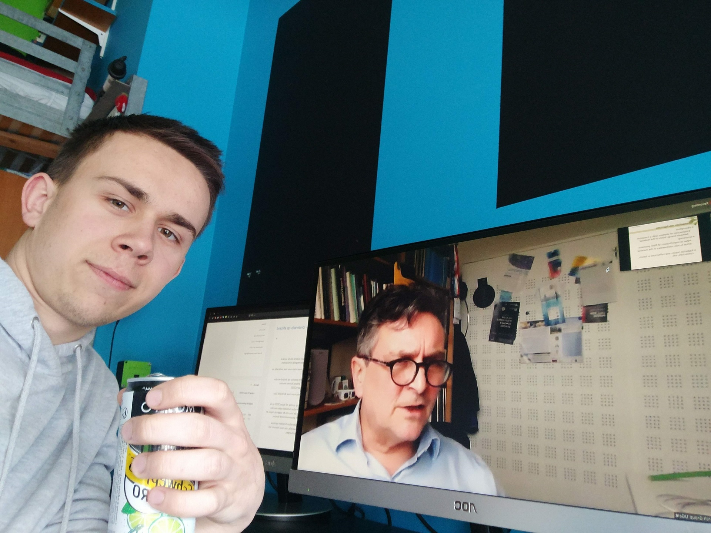

On the first day at university one of the professors told us the following:

> The following years will be the period of your lives where you will get to process the most information, unparalleled by any that came before it and, probably, that will follow.

I must say that after these three years I have a feeling he was speaking the truth that day. While I pretty much still look the same as I did back when I started, I consider myself a different person. The amount I have grown, both in my abilities and as a person, feels unreal.

For today, which by a happy coincidence also happens to be my birthday, I received the results for my final exam period marking the end of my bachelor studies. For some reason this milestone felt like a great opportunity to take a look back and reflect on all that's happened.

## In the beginning...

During high school I was introduced to electronics and programming by my uncle by means of an Arduino starter kit. While going through the tutorial projects a feeling of empowerment started growing on me. Harnessing the power of this microcontroller I could build myself innovative devices, such as [drumrolls] an alarm clock! I know, impressive huh, but that's how it all started.

Of course one thing led to another and I ended up buying a 3D printer kit. Along with my new-found skills in 3D modelling this resulted in my creations becoming slightly more pleasing to look at.

Personal projects like these and the connection I felt by participating in the upcoming maker community led me to develop an interest in engineering, more specifically in the fields of electrical engineering and computer science. In the summer of 2017 I decided to enter the engineering program at Ghent University.

## Highlights of my uni experience

Since an article such as this one is too short to go over all three years of my bachelor studies in detail I will just go over some of the highlights that sprung to mind while scrolling through my photos.

### Engineering project 1

The first year, as one could expect, existed mostly out of mathematics and general science classes. This makes the first engineering project all the more memorable, actually putting some of the material we had seen into practice. 

Along with three other students we got to hack a tv/radio dongle to receive surveillance broadcasts from airplanes using Python and built ourselves an antenna to connect to it. This project immediately showed me an application where hardware and software got combined to obtain a solution.

Amazingly, our system worked well enough to spot airplanes at distances just shy of 280km, which is quite honestly a miracle considering how dodgy both our code and the antenna were in retrospect.

Luckily the later years contained more projects and  practicums like this in which I kept being reminded the reason why I was doing all of it; to make things.

### Hackathons

Speaking of dodgy coding practices, hackathons! There's just something magical about sitting down to work out and develop and idea to the best of your abilities in the timespan of a couple hours. While the result might not always be what you would expect and I have never won any prizes participating in them, the amount of things you can learn in such short time is unbelievable.

Besides that, hackathons are in my opinion a very good place to meet like-minded, driven and entrepreneurial people, which always has possibilities to play to your advantage even long after the event itself has ended.

### Seeds for the future

One of the things I realized is that just by being enrolled in a university program a lot of opportunities open themselves up if you just spend some time and effort exploring the possibilities. A prime example of this is the 'Seeds For the Future' program organized by Huawei that I got to enjoy last summer.

All it took was producing an [application video](https://photos.app.goo.gl/qszfn8UUev5zeuGc6), writing an up-to-date CV as well as a short interview and a good bit of luck to be selected for the program. As a result I got to spend more than two weeks in China learning about its culture and looking behind the curtains of Huawei's 5G technology.

Needless to say this was a full and memorable experience, which probably deserves its own little article.

### Student life

Of course a write-up about my experiences at university can't be complete without a word on student life. While I've had my fair share of nights out I can hardly be called a party animal.

When I'm talking about student life I really mean more the day to day life as a student. Since my first year I've been living at a student apartment on weekdays, which afforded me the freedom to develop my own habits and rhythm of life for the first time. 

From meeting with friends without having to take anyone else's plans into account to preparing my own meals on a regular basis and thus improving my cooking skills. I believe these freedoms were the biggest catalyst to my growth as a person and led me to be more self-responsible. 

### Covid

2020 has been a strangely eventful year up to this moment. Starting of during the [Hong Kong protests](https://en.wikipedia.org/wiki/2019–20_Hong_Kong_protests) and the [Australian bushfires](https://en.wikipedia.org/wiki/2019–20_Australian_bushfire_season) and more recently with the [#BlackLivesMatter](https://twitter.com/hashtag/blacklivesmatter)  movement activated by the killing of George Floyd.          

The event that brought the biggest disruption in my own  day-to-day life however was the outbreak of the Corona pandemic, forcing all students in higher education to attend classes over the internet.  While the switch definitely took a lot of effort from all parties  involved, all was brought to a working stage surprisingly quickly.

While the circumstances brought a unique set of difficulties with them, all in all I feel like they were manageable. In any case it  could've been way worse if these amazing technologies we have today were not available. Nonetheless, I look forward to having classes and  practicums on campus again as well as being able to meet with friends  after class. Let's hope all goes well. 

## In the end?

After these three years I have obtained my first university  degree, even graduating with highest honors. But of course this is far  from the end. If anything it's another beginning.    

I look back with a feeling of accomplishment and a good bit of pride,  but while writing this post I noticed more than anything how my most  cherished memories of the past few years have little to do with my  accomplishments. Rather they were all about exploring my interests,  connecting with other people and having fun while doing so. I hope this  post may serve as a reminder to my future self, or anyone else reading  this, not to get caught up too much in the performance stress of  day-to-day life, but to slow down and enjoy what you're doing.     

I absolutely look forward to what the next couple of years will bring. I certainly have some exciting plans and I expect I'll have a lot more to write about. But for now, that's how I got here. 