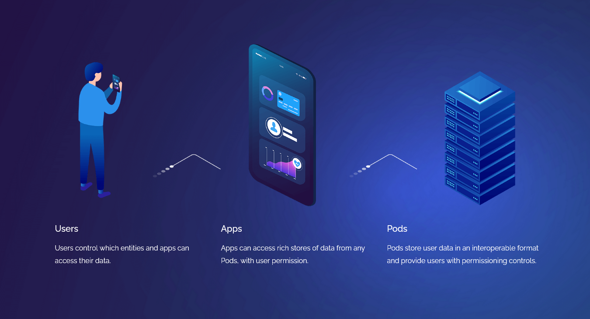
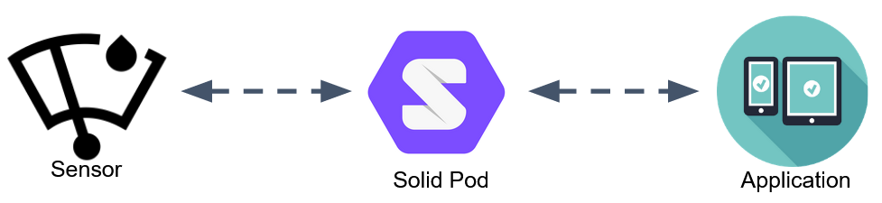
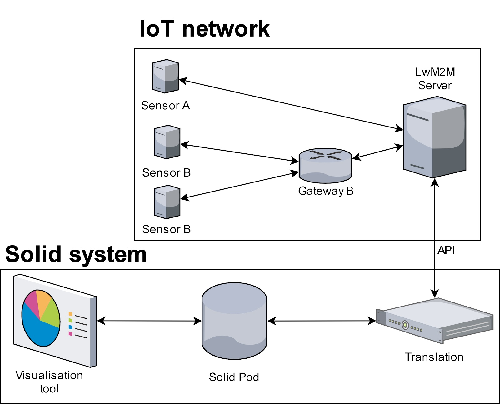

import internshipReport from "./solidiot.assets/internship-report.pdf"

import thesisReport from "./solidiot.assets/thesis-report.pdf"

In 2020, during my bachelor thesis at Ghent University and subsequent internship at Digipolis Ghent (now District09), I had the pleasure of collaborating on a set of projects that explore the use of Solid Pods for storage of Internet of Things sensor data. While working on these projects was very interesting and rewarding, I felt like something was still missing. In the technical reports, it is thoroughly described what we did and how we achieved this. However, in this article I want to place the work in its context, explain why I believe it matters, and hopefully spark your interest in the topic at hand.

## What is Solid?

### The World Wide Web

Before diving into the Solid project, I want to take a step back and have a look at the [world wide web](https://www.w3.org/History.html).  
The web, as invented by Sir Tim Berners-Lee in 1989, consists of three core technologies:

- An identification system for the documents on the web: **Universal Resource Locator/Identifier** (URL/URI).
- A publishing language to describe the content of those documents: **Hypertext Markup Language** (HTML).
- A protocol for transferring these documents over the internet: **Hypertext Transfer Protocol** (HTTP).

The combination of these technologies (with others) truly revolutionized the way society works. To say anything less would be an incredible understatement. [59 percent](https://www.statista.com/statistics/617136/digital-population-worldwide/) of the global population actively uses the internet, on average spending [2 hours and 41 minutes](https://www.statista.com/statistics/319732/daily-time-spent-online-device/) online per day. The reach of the web results in such unfathomable statistics that they can only be grasped by [experiencing them](https://www.webfx.com/internet-real-time/).

### Privacy and freedom

While the web has been one of the main driving sources in the democratization of information, education and innovation over the past three decades, not everything is puppies and rainbows either. In his article on the thirtieth anniversary of the web, Tim identifies three sources of dysfunction on the web:

> 1. **Deliberate, malicious intent**, such as state-sponsored hacking and attacks, criminal behaviour, and online harassment.
> 2. **System design that creates perverse incentives** where user value is sacrificed, such as ad-based revenue models that commercially reward clickbait and the viral spread of misinformation.
> 3. **Unintended negative consequences** of benevolent design, such as the outraged and polarised tone and quality of online discourse.

An additional consequence of the ad-based revenue models mentioned in point two is the urge for corporations to track our every move in order to make their advertisements better targeted and hence more effective. In her book [_The age of Surveillance Capitalism_](https://shoshanazuboff.com/book/about/), Shoshana Zuboff motivates lengthily why this phenomenon is a threat not only to privacy, but also our freedom as humans and even our democracy.

You might believe these claims are largely exaggerated and maybe you don't care about such mass surveillance practices, because ["you have nothing to hide"](https://www.amnesty.org/en/latest/campaigns/2015/04/7-reasons-why-ive-got-nothing-to-hide-is-the-wrong-response-to-mass-surveillance/). And besides, these ingenious revenue models are the reason why we are able to use all of these web services free of any (or at very low) cost. A key thing to consider here is what form of freedom we are choosing to prioritize. In the open source software community, two such forms are distinguished:

- Free as in "free beer" (gratis). This is the model that most apps uses, in which no payment is required for the user to enjoy the service.
- Free as in "freedom of speech" (libre), which signifies the liberty to use, study and change the software in any way the user desires.

Right now the focus seems to be on products and services which are gratis, but which puts many restrictions on the liberty of their users. Think of how anyone is able to make an account and publish content on the various social media platforms existing today. Many of us think of these websites as an extension of the **public space**. The reality however is that none of us have a say in how the provided content is processed, let alone how these platform operate. This is because these platforms, and by extension the data, are under control of **private companies** with their own interests in mind. The comparison Edward Tufte makes shows us best what this means:

> There are only two industries that call their customers ‘users’: illegal drugs and software.

Having identified these issues, Berners-Lee is not planning to sit back and wait until they magically go away. As a response, he started the Solid project in 2016. In 2018, he launched a commercial venture, [Inrupt](https://inrupt.com), to provide the Solid project with sufficient commercial energy.

### The Solid Project

So what is this silver bullet that should solve all the web's issues?  The main premise of Solid is to turn the distribution of data on the web on its head, or perhaps more accurately [right side up](https://inrupt.com/turning-the-privacy-world-right-side-up). Rather than a person's data being scattered over dozens of impenetrable systems or "data silos" (social media, government, job platforms, etc.), Solid proposes to combine all of it and store it in a personal storage Pod. Applications that need access to your personal data can then request permission to use or change it.

"Hold on!", I hear you say, "Why should I trust Solid or Inrupt with all of my data?"  
The beautiful thing is: you don't have to. Solid is not a product that can only be sold by one company. Just like HTML and HTTP, it is an **open standard**. As a result, multiple providers can host and offer Solid Pods for you to choose from. And if you trust no-one, you could still take the route of self-hosting a server.

In the end, the Solid Project is about choice. Putting the users back in control of their data allows them to decide which form of freedom they deem more important: monetary or otherwise. The further implications this change would have in terms of [web application design](https://ruben.verborgh.org/blog/2017/12/20/paradigm-shifts-for-the-decentralized-web/) and how this could unlock [increased innovation and economic growth](https://ruben.verborgh.org/blog/2020/12/07/a-data-ecosystem-fosters-sustainable-innovation/) are beyond the scope of this article and are already explained better than I could have in Ruben Verborgh's blog posts.

## Internet of Things

The Internet of Things (IoT) was first [coined](https://www.rfidjournal.com/that-internet-of-things-thing) as a term by Kevin Ashton in 1999 and describes a system where devices collect, process and communicate data with each other without the need for human intervention. In more practical terms, David Rose explains the concept in [_Enchanted Objects_](https://enchantedobjects.com/#/enchanted-objects/), where the objects we already use today get "smart", come to know us and respond to our needs. This is a simple yet powerful concept with many application fields, from autonomous vehicles in agriculture and [smart manufacturing](https://spectrum.ieee.org/telecom/internet/the-industrial-internet-of-things) to the [quantified self](https://quantifiedself.com/) and [medical applications](https://www2.deloitte.com/global/en/pages/life-sciences-and-healthcare/articles/medtech-internet-of-medical-things.html). Ashton put it this way:

> The Internet of Things has the potential to change the world, just like the internet did. Maybe even more so.

While the tremendous growth of the field over the past decades seems to confirm these insights, there still remains significant hurdles to be overcome. Not least of which are the issues of [platform fragmentation](https://www.qualcomm.com/news/onq/2016/02/19/fragmentation-enemy-internet-things) and concerns about [privacy](https://madsg.com/wp-content/uploads/2015/12/Designing_the_Internet_of_Things.pdf#p303). Now, if these issues sound familiar then we're thinking in the same direction.

The practices we see on the web make it clear that there's an incredible amount of value that can be created through the combination of big data and machine intelligence algorithms. However, the idea of my heart-rate data or measurements of a presence-detection system or other such sensors residing in the cloud and being available to a company or government institute to use as they like makes me shudder.

A lack of interoperability and transparency when it comes to data handling is precisely what Solid is attempting to solve. Wouldn't it be interesting then, to use this new technology in combination with IoT?

## Solid and IoT

The idea of applying the advantages of the web, and even the semantic web, to the Internet of Things in order to solve some of its problems is not new. Companies like Siemens and Google as well as the World Wide Web Consortium (W3C) have dedicated research groups to investigate this phenomenon called the [Web of Things](https://www.w3.org/WoT/) or the [Physical Web](http://google.github.io/physical-web/). However, as the Solid project is just starting to mature, very little information is available on how these technologies can be combined.

Nonetheless, the idea is really simple. Rather than having the manufacturers of these IoT devices set up huge servers to store and collect the data produced by these sensors, the interactions with all of your enchanted objects could be mediated by a Solid Pod.

Such an approach would have a couple of features that solves some key problems with current implementations:

- By putting the user back in control of their data, the concerns about privacy and ownership are decreased by orders of magnitude.
  If we can decide for ourselves which applications and parties have access to what parts of the data and for which purpose, we can choose not to opt in for programs that allow [supermarket chains to know about the pregnancy of your daughter before you do](https://www.forbes.com/sites/kashmirhill/2012/02/16/how-target-figured-out-a-teen-girl-was-pregnant-before-her-father-did/?sh=2234ba816668).
- As Solid is built on open standards, the danger to buy something and be locked into an ecosystem due to a lack of interoperability disappears as well. Even more, by separating the data from the application and opening up the possibility for other applications to work with it, abandonware could be a thing of the past.
- Having control over your data also opens up other possibilities. People could decide to share some of their valuable data with researchers to advance the knowledge in topics of their interest. For example, measurements of the energy consumed in homes could be really valuable in the battle against climate change. While [citizen science](https://ec.europa.eu/digital-single-market/en/citizen-science) initiatives exist already, with the use of Solid the logistics of setting up such studies would be simplified significantly.

The projects I collaborated on were meant to perform preliminary research verifying that this concept is indeed practically feasible. A proof-of-concept network, comprising of a couple of sensors publishing their data to a Solid Pod was built. While the outcome was generally positive, some key problems were identified and it is clear that a lot more work is required before the technology is ready for prime time.

If you want to get technical, I encourage you to read the [conference paper](https://lib.ugent.be/catalog/pug01:8694858), <a href={internshipReport} download>internship report</a> or <a href={thesisReport} download>thesis report (Dutch)</a> on the subject or to dive into the code base for the [internship project](https://github.com/lab9k/Solid-Pods-For-IoT) or my [bachelor thesis](https://github.com/th1j5/IoT-Solid-project). You're also most welcome to send me a message regarding any questions, remarks or suggestions on the subject.
