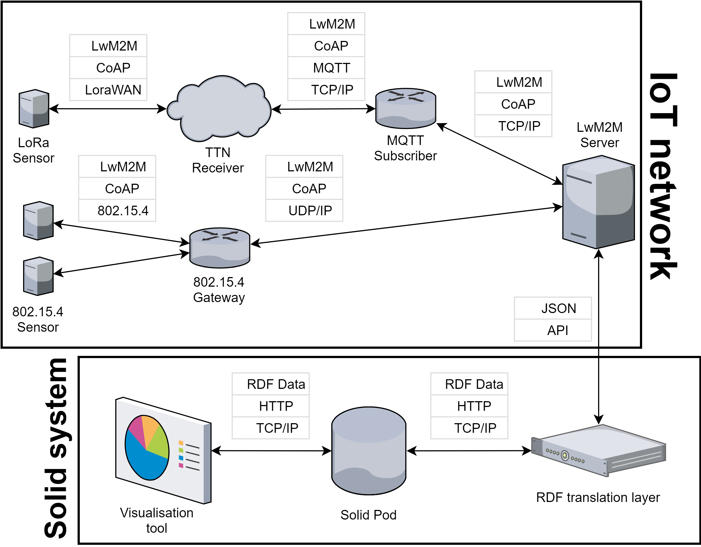
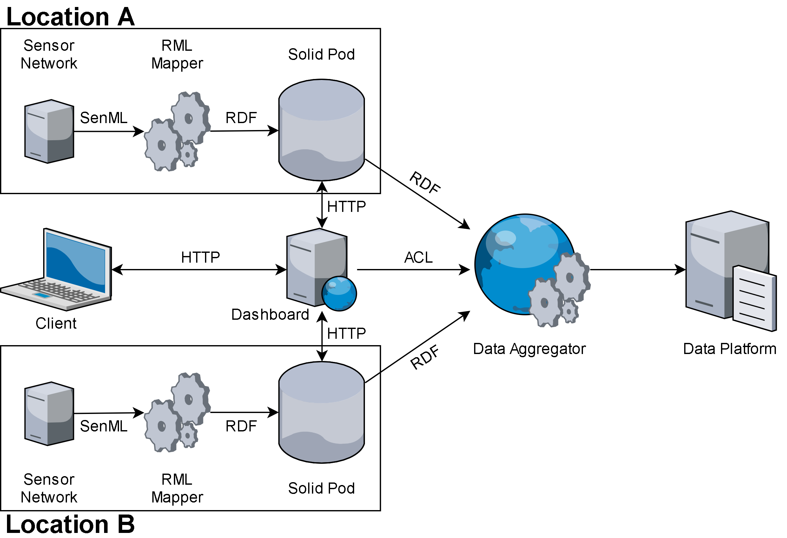

---

slug: "solidiot"
title: "Solid Pods for the Internet of Things"
subtitle: "How the next web revolution can improve sensor networks."
date: "2021-02-28"
author: "Flor Sanders"
tags: ["Project", "IoT", "Solid"]
cover: "solidiot-bg"
---

import internshipReport from "./solidiot.assets/internship-report.pdf"

import thesisReport from "./solidiot.assets/thesis-report.pdf"

Last year, during my bachelor thesis at Ghent University and subsequent internship at Digipolis Ghent (now [District09](https://district09.gent/en)), I had the pleasure of collaborating on a set of projects that explore the use of [Solid Pods](https://solidproject.org/) for storage of Internet of Things sensor data. As an electrical engineering student the topics of Linked Data and the Semantic Web were a touch out of my comfort zone, so it's safe to say I learnt a lot. In this article I will give an overview of the project, evaluate the current state of affairs and take a look towards future possibilities.

## What is Solid?

### The World Wide Web

Before diving into the Solid-project, I want to take a step back and have a look at the [world wide web](https://www.w3.org/History.html).  
The web, as invented by Sir Tim Berners-Lee in 1989, consists of three core technologies:

- An identification system for the documents on the web: **Universal Resource Locator/Identifier** (URL/URI).
- A publishing language to describe the content of those documents: **Hypertext Markup Language** (HTML).
- A protocol for transferring these documents over the internet: **Hypertext Transfer Protocol** (HTTP).

The combination of these technologies (with others) truly revolutionized the way society works. To say anything less would be an incredible understatement. [59 percent](https://www.statista.com/statistics/617136/digital-population-worldwide/) of the global population actively uses the internet, on average spending [2 hours and 41 minutes](https://www.statista.com/statistics/319732/daily-time-spent-online-device/) online per day. The reach of the web results in such unfathomable statistics that they can only be grasped by [experiencing them](https://www.webfx.com/internet-real-time/).

While the web has been one of the main driving sources in the democratization of information, education and innovation over the past three decades, not everything is puppies and rainbows either. In his article on the thirtieth anniversary of the web, Tim identifies three sources of dysfunction on the web:

> 1. **Deliberate, malicious intent**, such as state-sponsored hacking and attacks, criminal behaviour, and online harassment.
> 2. **System design that creates perverse incentives** where user value is sacrificed, such as ad-based revenue models that  commercially reward clickbait and the viral spread of misinformation.
> 3. **Unintended negative consequences** of benevolent design, such as the outraged and polarised tone and quality of online discourse.

An additional consequence of the ad-based revenue models mentioned in point two is the urge for corporations to track our every move in order to make their advertisements better targeted and hence more effective. In her book [*The age of Surveillance Capitalism*](https://shoshanazuboff.com/book/about/), Shoshana Zuboff describes this phenomenon as a threat to privacy, freedom and democracy. 

Having identified these issues, Berners-Lee is not planning to sit back and wait until they solve themselves. As a response, he started the Solid project in 2016. In 2018, he launched a commercial venture, [Inrupt](https://inrupt.com), to provide the Solid project with sufficient commercial energy.

### The Solid Project

So what is this silver bullet that should solve all the web's issues?  The main premise of Solid is to turn the distribution of data on the web on its head, or perhaps more accurately [right side up](https://inrupt.com/turning-the-privacy-world-right-side-up). Rather than a person's data being scattered over dozens of impenetrable systems or "data silos" (social media, government, job platforms, etc.), Solid proposes to combine all of it and store it in a personal storage Pod. Applications that need access to your personal data can then request permission to use or change it.

"Hold on!", I hear you say, "Why should I trust Solid or Inrupt with all of my data?"  
The beautiful thing is: you don't have to. Solid is not a product that can only be sold by one company. Just like HTML and HTTP, it is an open standard. As a result, multiple providers can host and offer Solid Pods for you to choose from. And if you trust no-one, you could still take the route of self-hosting a server.

The implications this change would have in terms of [paradigm shifts for web applications](https://ruben.verborgh.org/blog/2017/12/20/paradigm-shifts-for-the-decentralized-web/) and how this could unlock [increased innovation and economic growth](https://ruben.verborgh.org/blog/2020/12/07/a-data-ecosystem-fosters-sustainable-innovation/) are beyond the scope of this article and are already explained better than I could have in Ruben Verborgh's blog posts.

## Internet of Things

The Internet of Things was first [coined](https://www.rfidjournal.com/that-internet-of-things-thing) as a term by Kevin Ashton in 1999 which describes where devices (things) collect, process and communicate data with each other without the need for human intervention. In more practical terms, David Rose describes the idea by means of [*Enchanted Objects*](https://enchantedobjects.com/#/enchanted-objects/), where the objects we already use today get "smart", come to know us and respond to our needs. This is a simple yet powerful concept with many application fields, from autonomous vehicles in agriculture and [smart manufacturing](https://spectrum.ieee.org/telecom/internet/the-industrial-internet-of-things) to the [quantified self](https://quantifiedself.com/) and [medical applications](https://www2.deloitte.com/global/en/pages/life-sciences-and-healthcare/articles/medtech-internet-of-medical-things.html). Mr. Ashton put it this way:

> The Internet of Things has the potential to change the world, just like the internet did. Maybe even more so.

## Solid and IoT

### Proof of concept 1

### Proof of concept 2

## Learn more

Curious to discover more about the project? 

- [Paper](https://ieeexplore.ieee.org/document/9340221/references#references)
- Internship
  - <a href={internshipReport} download>Final report</a>
  - [Technical demonstration](https://www.youtube.com/watch?v=1PdD8B2Bshw)
  - [Codebase](https://github.com/lab9k/Solid-Pods-For-IoT)
- Bachelor thesis
  - <a href={thesisReport} download>Final report (Dutch)</a>
  - Codebase
