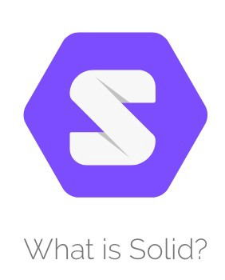

# Solid Pods for the Internet of Things

*How the next web revolution can help the Internet of Things.*

Last year, during my bachelor thesis at the IDLab research group and subsequent internship at Digipolis Ghent (now [District09](https://district09.gent/en)), I had the pleasure of collaborating on a set of projects that explore the use of [Solid Pods](https://solidproject.org/) for storage of Internet of Things sensor data. As an electrical engineering student the topics of Linked Data and the Semantic Web were a touch out of my comfort zone, so it's safe to say I learnt a lot. In this article I will give an overview of the project, evaluate the current state of affairs and take a look towards future possibilities.

## Solid

For starters, what in the world is Solid?
The [Solid Project](https://solidproject.org) is an initiative by Sir Tim Berners-Lee, the inventor of the web, to solve the technical problem of the [read/write web](https://web.archive.org/web/20181102095714/https://readwrite.com/2003/04/19/the_readwrite_w/). By introducing a thing called Solid Pods, which are in essence online data vaults, the web is transformed from a one-way publication medium to a collaborative space where everyone can create and share content.

Now you might be thinking: can't we already do this? We have platforms such as Twitter, Facebook, LinkedIn and Youtube where anyone is already able to freely create and publish content. Well yes, but also no. See, the term "freely" is quite misplaced here. Not only do these platforms come at the well-known cost of privacy to the users, the precise mechanisms on which they operate are unknown to anyone outside the companies and far from standardised.

This results in your personal data, from your name and phone number to your location history and medical information, being fragmented over several different data silos. Consequently you quickly lose overview of what's where and who knows what about you, but the first thing you lose is a feeling of control. In many cases we, as users, have no means of accessing our data or control which part of it can be used or retained by what applications.

The promise of the Solid Project is to change this situation. Instead of being splintered across several closed silos all of your data would reside in your personal Solid Pod, under your control. As both the Pod and all interactions with it are standardised in an [open protocol](https://solid.github.io/specification/#protocol) built on [Linked Data](https://www.w3.org/wiki/LinkedData) principles, you would have the freedom of where your data is stored and what you're willing to pay for it. Including the option of hosting everything yourself. Beside the clear advantages for consumers, the economics of this new system work out surprisingly well for companies too, as clearly explained in this [blog post](https://ruben.verborgh.org/blog/2020/12/07/a-data-ecosystem-fosters-sustainable-innovation/) by Ruben Verborgh.

## Internet of Things

So what does all this have to do with IoT? 
The Internet of Things has many applications, such as industry 4.0 (IIoT), medical and healthcare (IoMT) and smart homes and has known tremendous growth during the past few years as both an industry and a field of study. However there are also still a lot of hurdles to be overcome.

## Solid and IoT

## Where we are now

## Where are we going?

