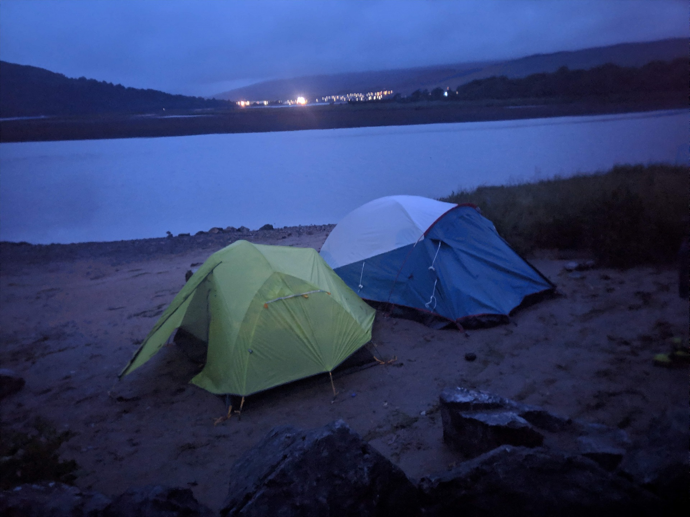
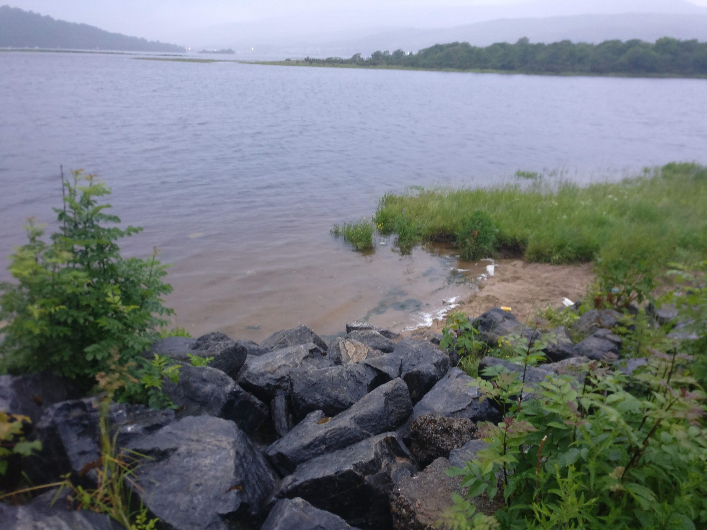
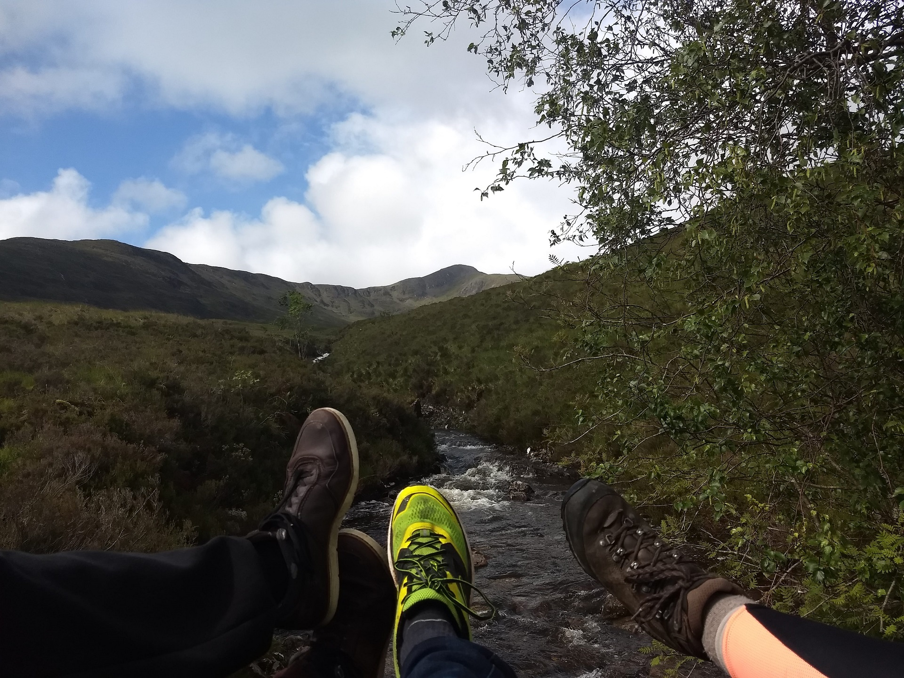
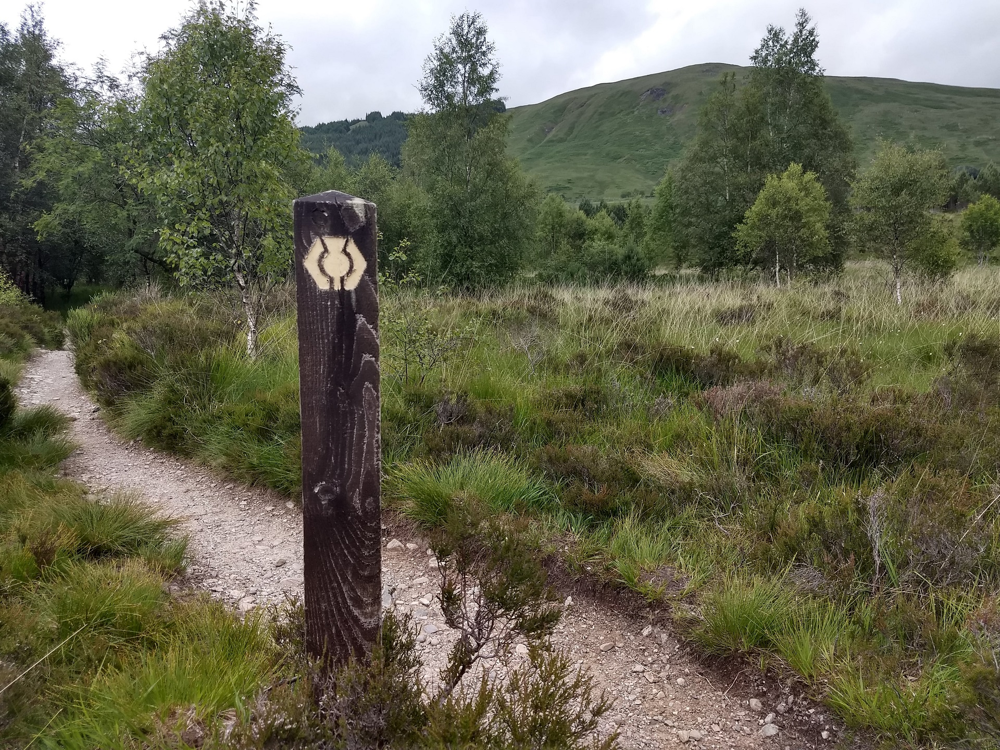
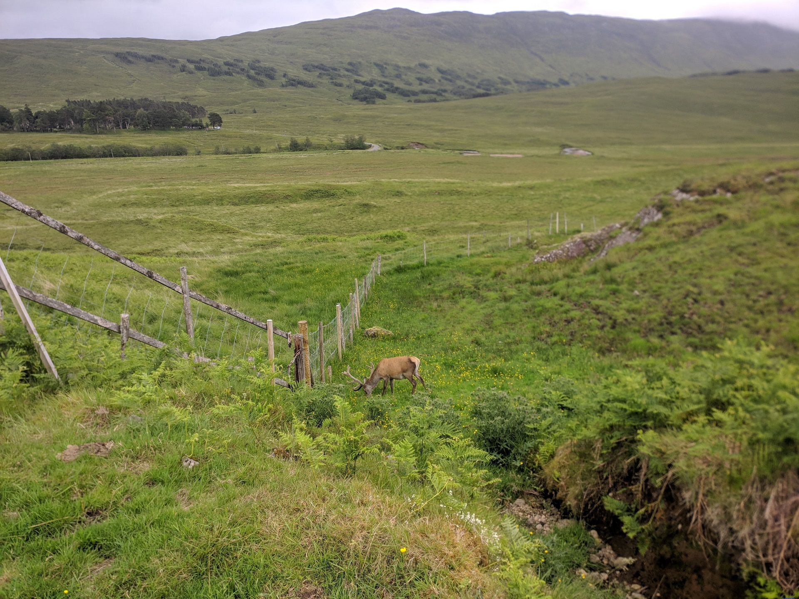
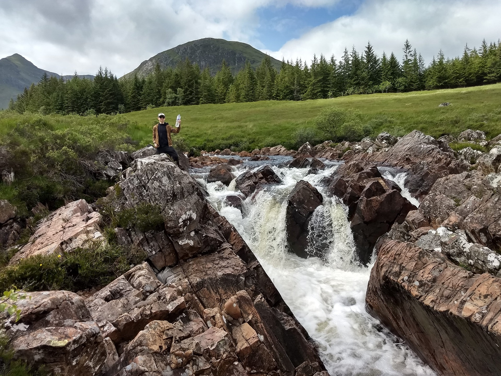

Last year I went backpacking for the first time, walking the West Highland Way with some friends. Since at the moment it is inadvisable to travel considering  the global situation we're in, I thought it might be fun to recall some  good memories instead.          

This post was inspired by a list made by one of the travel companions,  containing all the dumb things we did leading to funny and memorable outcomes. Hence the title.

## Always set up camp by the lakeside

On the first night we took the train to Fort William, since we were actually walking the West Highland Way in the opposite direction. We arrived in town just past 10pm and went looking for a camping spot. A friendly passerby gave us the advice to set up camp at the lakeside, telling us it would be quite cozy and we wouldn't risk disturbing anyone. So we did, and all was good.

Or at least that's what we thought at first. After chatting a bit, sipping on our whisky's to get in the Scottish mood, we went to sleep. Though after a couple of hours we were awakened by the sound of waves crashing onto the shore, along with a voice coming from the  other tent: "Uh guys, get up! The water's nearly at our feet."

 

It was 4:30am, awakened by this alarming message, we got up and began breaking down our camp as quickly as our sleepy haste would allow. Once we were safe, we had a very early breakfast and took the first bus to Kinlochleven, where we would start our walking adventure.

At 9am we had our lunch on the road and subsequently told  every passerby to have a "good afternoon" for the rest of the morning.  Finally we arrived at our second camping spot at Kingshouse in the early afternoon. After setting up camp and having a quick bite we felt  exhausted, so we went to bed and ended up sleeping for 14 hours  straight.

##  Trust your orientation skills 

One of the reasons we chose to walk the West Highland Way was because it seemed quite beginner-friendly. We found a lot of information about it online while preparing and were also happy to hear there would be pathmarkings along the way, making it harder to lose the track. Besides, we brought a map, what could possibly go wrong? 

Still, somehow, leaving Inveroran I managed to misread all signs sending us utterly in the wrong direction. The mistake was made at an intersection, where one option was to follow a road fit to drive a car on and the other was a footpath leading to a fence that could be crossed by taking some stairs. Since we were supposed to walk in nature, I naively decided the second option would be the best fit.

Right after crossing the fence we saw a deer grazing at not even 10 meters distance, so of course we had to take a photo. In hindsight the most interesting thing about the picture isn't the deer, but the fact that the road we were supposed to take is clearly visible in the background. Though at that moment, not having any clue that there was a good chance we were going the wrong way, we continued further right.

After stubbornly going on for more than an hour, climbing over several more fences along the way, we finally turned on our gps to realize how far we had strayed from our path. When we finally managed to retrace our steps, basically returning to our starting point after hours of walking, we continued to the Bridge of Orchy. There we had a pint, played some cards and finally decided to take the bus to Tyndrum, our camping spot for that evening. 

##  Ignore advice from the internet

While preparing for our trip we read every blog article, travel guide and reddit post we could get our hands on, looking for advice on how to organize ourselves, what to take with us and what to wear. In the end though, I feel like we ignored most of it.

Instead of buying fancy trekking clothes of merino wool, we mostly went for simple yet comfortable clothing: jogging trousers, t-shirt, sweater and some sturdy but old sneakers. For the essential camping gear we were missing, we went to our nearest decathlon and mostly bought the cheapest options that would fit our need.

For the most part this worked out just fine, both choices mentioned previously didn't cause any major discomforts as far as I can recall. In other cases though, things didn't turn out that great. For some reason I believed buying a decent backpack wouldn't be worth the cost for a single one-week trip, so I went for a cheap 55L one I got via a supermarket loyalty plan. While being large enough to fit all of our stuff, it offered close to no back support. Let me tell you that after a week of carrying this I wished I just had spent a little more.

Besides that we made some additional smaller mistakes, like assuming that "these midges, they can't be that bad right" and opting for canned rather than dried food causing us to carry more weight than we should have.

One piece of advice we did take, and I am really happy for, was not to try to carry all the water we would need between villages. Instead we always filled our bottles from one of the many streams we passed along the way, adding some drops of chlorine to disinfect it. By doing so, we had no need to be afraid to run out of water and had plenty make our Royco soup even when no campsite was present.

##  Pretend like all goes according to plan 

While the previous headings obviously pointed out what not to do, this one is actually a piece of sincere advice. While we made errors along the way (actually way more than the ones mentioned in this post), I wouldn't change them if I could do it again. Because these mistakes very often lead to events that made our trip special and memorable. So rather than cursing ourselves for making them, we mostly just went with it and pretended everything was going according to plan. 

From all of the journeys I had in my life to this day, this first backpacking adventure remains one of the most memorable experiences I've ever had. During the past year I often went back to look at the photos we took and every time a bunch of good memories instantly came back to me. So if anyone is doubting to do something similar, I'd say go for it, I'm certainly looking forward to my next opportunity to do the same.

